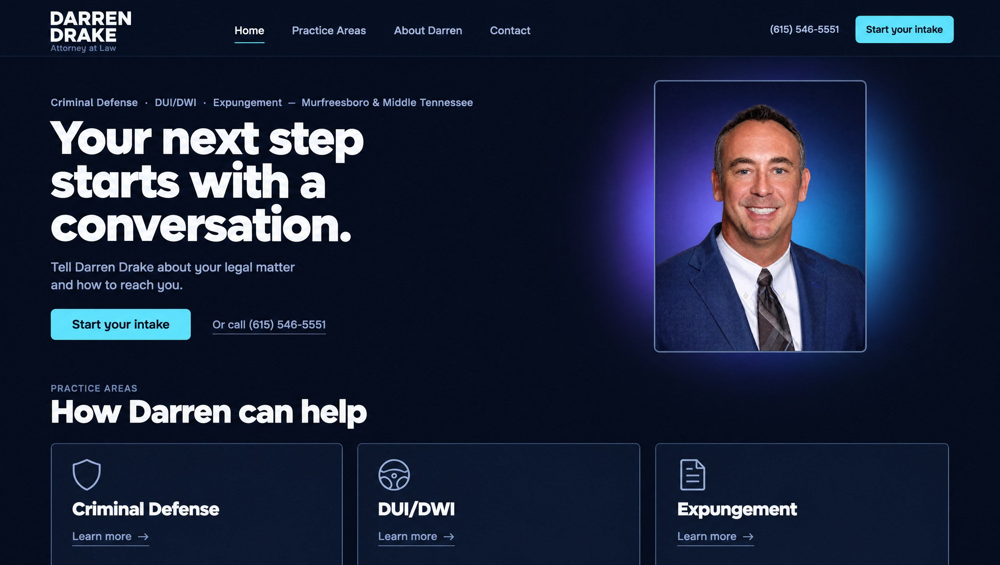

# Darren Drake website: build and launch plan (Signal 1A)

Prepared 24 September 2026. While preparing it, nothing on ddrakelaw.com and nothing in the project files was changed. The new site stays private until Darren signs off.

**How to read this plan**
- "Plan at a glance" (next) fits on one printed page. Sections 1 to 14 are written for you and Darren. The appendices hold the technical detail.
- Each task has a tag showing who does it:
  - **[Claude]**: I do it, when you open a session and ask.
  - **[You]**: you do it, or pass it on to the firm.
  - **[Darren/firm]**: only the firm can decide or do it.
- **"Unconfirmed"** means the fact appears somewhere (usually the old website) but Darren hasn't confirmed it. Unconfirmed facts never go live.

---

## Plan at a glance

**Goal:** replace ddrakelaw.com with a complete Signal 1A website whose main job is to get a worried visitor's short inquiry safely to the firm (with the phone always there as a second option), using only facts Darren has confirmed, and without losing search traffic or breaking the firm's email.

| Phase | What happens | Who is mainly involved | What it needs to start |
|---|---|---|---|
| **0 Content and approvals** | Facts sheet, decisions, account owners, a dated copy of the old site | Darren/firm and You; Claude prepares the packs | Nothing. It can start now. |
| **1 Design lock and assets** | New photo placed in the design; screenshots of every page type next to the 1A concept | Claude; You and Darren review | Photo approval (work can go ahead marked "pending") |
| **2 Full site build** | Every launch page built; unconfirmed text blocked from going live | Claude; Darren supplies or approves copy | Phase 1 look approved; D1 (leave WordPress) decided |
| **3 Intake connection** | The form connected to an inbox the firm owns, proven with test data | Claude; the firm sets up accounts and names recipients | D7 and D8 answered; firm-owned accounts |
| **4 Search and migration prep** | Page titles, a redirect for every old address, Google listings, a security check of the old server | Claude; You with the firm and its server admin | Phase 2 pages for titles (redirects, listings and the server check can start earlier); Search Console access |
| **5 Quality checks** | Accessibility, speed and copy checks; legal checklist signed | Claude; You on real phones; Darren signs | Final copy in place |
| **6 Private preview and sign-off** | Darren reviews the finished site and says "go" in writing | Darren and You | Phase 5 passed |
| **7 Launch** | Two domain entries switched; email, redirects and intake checked; a way back ready | Claude with the Cloudflare owner; the named intake recipient | Written sign-off; account access |
| **First 30 days (then day 90)** | Checks on days 1, 7, 14 and 30; listings updated; old server retired at day 90 | You open sessions and Claude runs the checks; the firm updates listings | Launch done |

**What we need from you and Darren first**
1. **Photo:** Darren's signed approval of the edited photo (Section 5), or a decision to use the original photo.
2. **Platform:** Darren's decision to leave WordPress for the new site (D1).
3. **Facts sheet:** Darren ticks, corrects or strikes each item (business name, address, hours, email, biography).
4. **Account owners:** who owns the domain registrar, Cloudflare, Google (Workspace admin, Search Console, Business Profile), the WordPress server and the code repository.
5. **Intake:** which case-management system the firm itself uses, if any, and at least two named people who will receive inquiries.
6. **Private previews:** a written OK to show private online previews on a firm-owned hosting account. Until then, you get screenshots only.
7. **Old server:** the name of whoever runs the WordPress server, so they can check it before launch for a possible compromise, which may not be over (unconfirmed).

**What Claude does first** (the same five steps as Section 14)
1. Build the facts sheet and decision pack for Darren.
2. Put the new photo into the demo on this computer and send side-by-side screenshots with the concept.
3. Save a dated, read-only copy of the current ddrakelaw.com.
4. Start the work that doesn't need firm content (footer, button sizes, placeholder guard, legal and error pages, speed).
5. Set up automatic checks and write the account and hosting setup guide for the firm.

---

## 1. The goal, and what "done" means

**The goal.** We'll replace the current ddrakelaw.com with a complete website in the Signal 1A style. That means a dark navy background, large bold Manrope type, a cyan "Start your intake" button, and the new photo of Darren with the violet-to-cyan glow behind it. The site's main job is to help someone who may be worried send Darren a short inquiry that really reaches the office. The phone number, (615) 546-5551, is always there as a second option. Every fact on the site must be confirmed by Darren, and nothing is invented. The move must not lose the old site's search traffic or break the firm's email.

**"Done" means all of the following are true on launch day:**

| Area | Launch criterion | How we check it |
|---|---|---|
| Design | Every launch page uses Signal 1A. At 1440×900 (a common desktop size) the home page's first screen shows the header, the eyebrow line, the three-line headline, the supporting line, the button, the phone link, the framed photo with its glow and the "How Darren can help" heading, as in the concept. On a phone, the headline and button appear before the photo. One main cyan button per section (plus the header button and, on phones, the bottom bar), each at least 52 px tall. | Side-by-side screenshots at phone (390 px), tablet (768 px) and desktop (1440 px) widths, approved in writing by Darren |
| Facts | Every fact on the site has Darren's written confirmation. No placeholder text reaches the live site. | Darren signs the facts sheet. An automatic check stops a live build if any placeholder remains. |
| Intake | A test inquiry has reached the firm's chosen destination, and the named intake recipient has confirmed it arrived and deleted it. "Received" appears only after the destination accepts the inquiry. If sending fails, the visitor's answers are kept and the phone number is shown. | Written test log (Section 8), signed by the named recipient |
| Accessibility | The site meets **WCAG 2.2 AA (the international web-accessibility standard, level AA)**: automatic scans find 0 problems on every page and form state, and keyboard-only use, 200% zoom, the narrowest phone width and a screen reader have each been tested by hand. | Test report |
| Speed | On a slowed-down test phone: main content visible in 2.5 seconds or less, no visible layout jumping, about 200 KB of code or less and about 1 MB total or less on first load | Automatic speed test on every change, plus real-visitor measurement after launch |
| Search | Every old web address in Appendix B reaches its new page in one step, or is marked "gone". The new sitemap is submitted to Google. The live site can be found by search engines; private previews and the hosting company's own `.vercel.app` addresses cannot. | Automatic address test and a Search Console check |
| Email | Firm email works before and after the switch | Test messages sent in and out on launch day |
| Accounts | Every account is owned by the firm, with a named owner and two-step login | Account list (Section 7) |
| Legal | Darren has signed the legal and ethics checklist (Section 9). A dated copy of the old site and of the new site is saved in storage the firm controls. | Signed checklist and archive files |
| Safety net | The old website stays intact for 90 days, kept running but no longer receiving visitors, so we can switch back within minutes | Rollback steps rehearsed (Section 11) |

---

## 2. What's already done

- **Concepts.** There are five brand directions and nine concept images. You chose **Signal Concept A**, saved as `brand-concepts/01-signal.png`.
- **Rules and build instructions.**
  - `Darren_Drake_AI_Brand_Guidelines.md` holds the brand, accessibility, speed and intake-form rules.
  - `prompts/signal-website-build-prompt.md` is the Signal build spec.
- **Working demo site** in `site/`. It exists only on this computer and hasn't been published.
  - It has 11 pages and routes: Home, Practice Areas, three practice pages, About, Contact, Intake, Privacy (placeholder), Page not found, and the form's back end.
  - The intake form works in "demo mode": it never pretends to send.
  - 17 of 17 automated tests pass. The automated accessibility scan, run at desktop width, finds 0 problems; phone widths, the open menu and hand testing with a screen reader are still to do.
  - In a lab speed test the main content appears in about 0.8 seconds.
- **Printouts.** `printouts/` has PDF handouts of every design option (including 1A) and of the Signal demo site, ready to show Darren. They show the original photo and the older footer, so they'll be reprinted after Phase 1.
- **Footer.** It was rebuilt from the shadcn "footer-section" component (from 21st.dev). It still needs a cleanup:
  - the hover tooltips add about 31 KB of code to every page;
  - the DARREN DRAKE name block (wordmark) is missing;
  - the year is worked out in the visitor's browser, and some leftover demo code remains;
  - the component's license hasn't been checked yet (the guidelines require it).
- **New photo.** `assets/photos/darren-drake-portrait-signal.webp` was added to the project, marked as pending Darren's approval.
  - It is Darren's real 2024 portrait: his face matches the original photo closely.
  - The background was replaced everywhere, including around his head and shoulders, and the colors of the whole image were adjusted.
  - An editing tool added about 130 pixels of jacket sleeve and shoulder on the left and a small strip at the lower right.
- **Research for this plan** (full reports in `plans/research/`) covered five areas: a read-only check of the live site, a code audit, a page-by-page design spec, a Tennessee advertising-rules checklist, and intake, hosting and search plans.
- **Precision set aside.** Precision B was shortlisted alongside Signal A (see `brand-concepts/README.md`), and a second demo (`site-precision/`) was built for it. It is set aside because you chose Signal 1A. It won't be published and is kept out of the hosting setup; its printouts stay available for reference.

---

## 3. Decisions

### Locked decisions

| Decision | What it means |
|---|---|
| **Design: Signal Concept A (1A)** | Dark navy `#090F1C`, Manrope type, cyan `#67E8F9` action color, violet-to-cyan glow behind the photo only, and a large DARREN / DRAKE name block in the header. **One main cyan button per section.** The header's "Start your intake" button (as in 1A) and the phone's bottom bar are the only repeats, and the bottom bar hides whenever another "Start your intake" button is on screen. Every other action is a text link. Every cyan button, including the header one, is at least 52 px tall (the guidelines' minimum); the demo's 44 px header and "Try again" buttons will be raised. |
| **Photo: the new Signal portrait** | Used on Home, About and in small circles elsewhere (Section 5). It goes live only after Darren gives written approval of the edited version. |
| **Phone: (615) 546-5551** | Shown on every page as a text link, never as the main button. It is the only phone number on the site (the build instructions say so); see the fax question in Section 7. |
| **Name and scope** | "Darren Drake, Attorney at Law". Criminal Defense, DUI/DWI and Expungement in Murfreesboro and Middle Tennessee. |
| **Main button** | Always reads "Start your intake". The form's send button reads "Send inquiry". |

### Decisions needed

| # | Decision | Options | Recommended default | Who decides | Needed by |
|---|---|---|---|---|---|
| D1 | **Leave WordPress for the new platform.** The brand guidelines say this move needs the firm's approval. | (a) Keep the built Next.js site and host it on Vercel. (b) Rebuild Signal as a WordPress theme. (c) A mix of both. | **(a)**. It's mostly built, and it already passes the automated accessibility scan (desktop width only so far) and the lab speed test. Its hosting account would be created and owned by the firm. Choose (b) only if staff must publish often without help, everything must stay on the current server, or an outside vendor maintains WordPress under contract. | Darren | Phase 1 |
| D2 | **Approve the edited photo** and where it's used | Approve all uses, approve some, or use the original photo | Approve it for the site, link previews, Google Business Profile and directories, using the note in Section 5 (each use has its own tick box) | Darren | Phase 1 |
| D3 | **About-page photo shape** | (a) Same upright crop as Home, cut from the part of the photo where only the background and colors were changed. (b) A wider crop that includes the sleeve and shoulder added by the editing tool. | **(a)**. It keeps the added areas off the site and keeps the file set small. | Darren (you can advise) | Phase 1 |
| D4 | **Who writes the practice pages** | Darren writes them, or Claude drafts plain wording and Darren edits and approves | **Claude drafts the structure and general wording with no legal specifics. Darren writes or approves every statement about Tennessee law.** | Darren | Phase 0 |
| D5 | **Juvenile defense** (a page exists on the old site) | (a) Add a fourth practice page. (b) Point the old page to Criminal Defense. (c) Remove it, and tell search engines it's gone for good. | **(b)** until Darren answers. **(a)** only if he confirms this work and supplies the copy. **(c)** if he doesn't take these cases. | Darren | Phase 0 |
| D6 | **Old testimonials pages** | Point them to About, or remove them | Point "Testimonials" to About. Remove "Submit a testimonial". **No reviews on the new site** until the firm has a written, ethics-reviewed policy. | Darren | Phase 4 |
| D7 | **Intake destination** | (a) Clio Grow lead inbox with email backup. (b) Email to a dedicated firm inbox with a second email service as backup. (c) Something else. | **First confirm which case-management system Darren's firm itself uses. Nothing found so far shows it uses Clio.** If the firm has its own Clio subscription that includes Grow, choose (a). Otherwise choose (b). Inquiries go only into accounts the firm owns, never into another firm's or person's Clio, inbox or tool. Don't buy a new system just for the website. | Darren or office manager | Start of Phase 3 |
| D8 | **Who receives inquiries, and how long they're kept** | Named people; how long inquiry content is kept | Only named staff, **at least two** (so holidays don't leave inquiries unread), each with two-step login. The firm sets how long inquiries are kept; we don't pick a number for them. | Darren | Phase 3 |
| D9 | **Visitor statistics tool** | Plausible, Vercel Web Analytics, Cloudflare Web Analytics, or none | **Plausible.** The vendor says it uses no cookies, so a cookie banner is likely unnecessary (no Tennessee or federal cookie-consent law was found; unverified). It sends only the guidelines' approved events, plus "phone tapped" if D10 is yes and "page not found" if Darren approves it here. | Darren (you can advise) | Phase 4 |
| D10 | **Count taps on the phone number** | Yes or no | **Yes.** It counts taps and where on the page they happened, nothing else. It is an addition to the guidelines' approved events, so it ships only with Darren's written OK. | Darren | Phase 4 |
| D11 | **Photo in "Meet Darren" on Home** | A licensed local photo (for example downtown Murfreesboro), or a card of confirmed facts | **The facts card at launch.** Add the photo later if a real, licensed one is supplied. No AI-generated places. | You and Darren | Phase 1 |
| D12 | **Optional ethics review** by the Tennessee Board of Professional Responsibility's Ethics Counsel (an informal inquiry; "Advertising" is one of its categories) | Ask, or skip | **Ask**, if Darren is comfortable. It's optional and not required. | Darren | Phase 5 |
| D13 | **Who owns and pays for the accounts**: code repository (GitHub), hosting (Vercel), email sending (Postmark, Resend), spam protection and domain settings (Cloudflare), rate-limit store (Upstash), statistics (Plausible), uptime and error alerts (UptimeRobot, Sentry if used), domain registrar, Google, Bing Webmaster Tools, Apple Business Connect | The firm, or a contractor | **The firm owns every account**, with two-step login, and names a **billing owner** (whose card pays). You are added as a member. I don't hold accounts of my own; I work through the access you give this project, which the firm can remove at any time. The code repository currently sits under a personal GitHub account; recommended: move it to a firm-owned GitHub organization before hosting is connected. | Darren | Phase 0 |
| D14 | **How edits happen after launch** | Ask Claude, who shows a private preview before publishing, or a simple editing screen for staff (Keystatic) | **Ask Claude at launch.** Add the editing screen later if staff want to edit themselves. Either way, Darren (or someone he names) approves every change. | You | After launch |
| D15 | **Old WordPress server** | Keep it for 30 or 90 days | **90 days**, untouched and kept running, but no longer receiving visitors. Then retire it. | Darren | Phase 7 |
| D16 | **Launch window** | Any weekday | A quiet weekday morning with staff available to answer the phone | Darren and you | Phase 6 |
| D17 | **Private online previews** | (a) Private previews on the firm's own Vercel account, behind a login. (b) Previews stay on this computer and you get screenshots. | **(a), once the firm's account exists.** The build instructions currently say "Run the preview locally only. Do not deploy", so this needs Darren's written OK first. | Darren | Phase 1 |

---

## 4. Sitemap and page plan

The new web addresses end in "/", the same style as the old site. That keeps `/` and `/contact/` unchanged, and every old page reaches its new page in one step.

### Pages at launch

| Page | Address | Purpose | Key sections | Content owner |
|---|---|---|---|---|
| Home | `/` | Say who Darren is and what he handles, and get people to start an intake | 1. Hero: headline, button, "Or call" link, photo with glow. 2. Three practice cards. 3. Meet Darren: short bio plus a card of confirmed facts. 4. How contact works (3 steps). 5. FAQ, next to a "Prefer to talk?" call card. 6. Intake band. 7. Footer. | Claude: layout. Darren: headline approval, card sentences, bio paragraphs, FAQ answers. |
| Practice Areas | `/practice-areas/` | Send people to the right practice page | 1. Intro with button. 2. Three cards. 3. "Not sure which applies?" note. 4. Three steps. 5. Intake band. | Darren approves the intro line and card sentences |
| Criminal Defense | `/practice-areas/criminal-defense/` | Plain-language page for people facing charges | 1. Hero with "On this page" links. 2. Overview. 3. What this can involve. 4. What to have ready. 5. Where Darren works. 6. "Your attorney" side card with a small photo. 7. Three steps. 8. FAQ (approved answers only). 9. Other practice areas. 10. Intake band. | Darren writes or approves every legal statement |
| DUI/DWI | `/practice-areas/dui-dwi/` | Same, for DUI/DWI charges | Same template | Darren |
| Expungement | `/practice-areas/expungement/` | Same, for people asking whether a record may be eligible | Same template | Darren |
| About Darren | `/about/` | Recognition and trust | 1. Hero with photo and glow. 2. "At a glance" confirmed facts. 3. Biography (Service, Education, Practice, Community) with a "Talk with the office" side card. 4. Intake band. | Darren confirms every biography item |
| Contact | `/contact/` | Every way to reach the office, with the intake first | 1. "Start your intake" card with a small photo. 2. "Call the office" card (phone, office, hours, email; a fax number only if Darren wants it, as plain text). 3. Location with a "Get directions" link, only once the address is confirmed. No embedded map. 4. Three steps. | Darren: address, hours, email, parking |
| Intake | `/intake/` | The inquiry form | 1. Demo notice until delivery is proven. 2. Helper note with a privacy link and phone. 3. The form. 4. Success and error messages. 5. On desktop, a side card with a small photo and the 3 steps. | Darren approves the helper, success and error wording |
| Privacy notice | `/privacy/` | What the form collects, where it goes, how long it's kept | Plain prose and a call card | Claude drafts from the real setup; the firm approves |
| Accessibility | `/accessibility/` | The standard we aim for (WCAG 2.2 AA) and how to report a problem | Plain prose | Claude drafts; the firm names a contact and approves |
| Legal notice | `/legal-notice/` | Not legal advice; the site doesn't create an attorney-client relationship | Plain prose | Claude drafts from the guideline wording; the firm approves |
| Page not found | (any wrong address) | Keeps old or mistyped links from dead-ending | Button, main links, phone | Claude |
| Something went wrong | (server error) | Keeps the phone reachable if anything breaks | Phone shown prominently, "Try again" | Claude |
| Behind the scenes | sitemap, robots file, link-preview image, icons | Search engines and link previews | none | Claude |
| **Only if confirmed:** Juvenile Defense | `/practice-areas/juvenile-defense/` | Only if Darren takes these cases and supplies the copy | Practice template; cards become a 2×2 grid | Darren |

**"What to have ready" on practice pages.** This list says what to have on hand for the conversation, not what to send. It links to the intake note about not sending documents.

### Later pages (not at launch)

| Page | When |
|---|---|
| FAQ hub `/faq/` | Once Darren has approved 8 or more answers |
| "What to expect" | Once the firm supplies process facts (first meeting, what to bring) |
| Attorney-written guides, for example "What changed in Tennessee DUI law" | Written and dated by Darren. No mass-produced articles. |
| Local architecture photo | When a genuine, licensed photo is supplied |
| Link-preview images for individual pages | Any time after launch |
| Staff editing screen (Keystatic) | If staff want to edit without asking Claude |

**Not planned:**
- a testimonials or reviews page (an ethics decision first);
- a blog at launch (the old one has no posts);
- a separate "thank you" page (anyone could open it without sending anything, which would break the truthful-confirmation rule);
- one page per city or county (Google's spam policies treat city pages that funnel visitors to one page as "doorway" abuse: https://developers.google.com/search/docs/essentials/spam-policies);
- live chat or an AI chatbot;
- texting.

---

## 5. The new photo



*Preview: the approved 1A concept with the new photo placed in its frame. The real site will use a crop cut from the genuine middle strip of the photo (right: the 4:5 hero crop).*


**Why the crops are placed where they are.** The genuine photograph is the middle strip of the new file, about half its width. Inside that strip the background and colors were still changed. Outside it, an editing tool added about 130 pixels of jacket sleeve and shoulder on the left and a small strip at the lower right, and the background is entirely new. So every crop on the site stays inside the middle strip. The exact pixel boxes are in Appendix C.

| Where | Photo shape | Shown at | Notes |
|---|---|---|---|
| **Home hero** | Upright (4:5), from the middle strip | About 420 px wide on desktop; about 256 px wide on phones (after the headline and button) | Glow behind the frame, tuned so it continues the photo's own light (violet left, cyan right). Loads first. |
| **About hero** | Same upright file | Up to about 420 px wide on desktop; up to 320 px tall on phones | Glow is still (no fade-in). The wider option in D3 shows the added sleeve and shoulder, so it needs Darren's explicit approval of that area. |
| **Practice pages ("Your attorney" card) and Intake side card (desktop only)** | Square, from the middle strip | 96 px circle | No glow. His name sits right beside it, so screen readers skip the image. |
| **Contact page intake card** | Same square | 64 px circle | Same |
| **Link preview** (when someone shares the site) | Navy card. The upright crop sits in the centre square, so apps that show a square preview still show his face. "DARREN / DRAKE" and "Attorney at Law" are typed on the left; the practice areas and "Murfreesboro & Middle Tennessee" on the right. | 1200×630 | The text is typed by code, not drawn by AI. You and Darren approve it with the Phase 1 screenshots. |
| **Google Business Profile and directories** | Square | 800×800 | Only after Darren approves this use |
| **Never** | none | none | Behind text, as a page background, on the practice hub, legal pages, error pages or footer. No further edits to his likeness. |

**Alt text** (read aloud by screen readers):
- Hero and About: "Darren Drake, attorney at law".
- Link preview: "Darren Drake, attorney at law, Murfreesboro and Middle Tennessee".
- Alt text never describes the background.

**Safety steps:**
- The original portrait stays in the project, untouched, as the master copy.
- One setting can switch the site back to it.
- We'll ask whoever edited the photo for the full-quality master file. The smooth background can show visible color bands when compressed.
- The full-size original that the demo currently makes downloadable will be removed.

**Approval note for Darren to sign** (a draft for Darren to check; he should compare the edited photo with his 2024 original before signing):

> I approve publication of the edited portrait of me (file `darren-drake-portrait-signal.webp`). I understand it was made from my 2024 portrait by replacing the background (including around my head and shoulders), adjusting the colors of the whole image, and adding about 130 pixels of jacket sleeve and shoulder on the left and a small strip at the lower right with an editing tool. My face and features were not reshaped or replaced.
>
> I approve its use on: [ ] ddrakelaw.com [ ] the site's link-preview image [ ] the firm's Google Business Profile [ ] directory listings.
>
> The firm [ ] has / [ ] does not yet have the photographer's permission to use edited versions. Photographer: ____________
>
> Signed: ____________ Date: ________

Once he signs, I'll record the approval in the project's asset register (Appendix C). I'll also note it in the build instructions, whose line 22 currently says never to retouch his likeness, so this approved exception is on file.

---

## 6. Phased roadmap

Every phase ends with a short summary for you. Once Darren gives the written OK for online previews (D17), it also includes a private preview link; until then, previews stay on this computer and you get screenshots. You can send other edits at any time: I'll keep one running change list and apply the edits on a preview first.

### Phase 0: Content and approvals

**Goal:** get the facts, decisions and account access, so nothing on the site is guessed.

**Tasks**
- [ ] [Claude] Make a one-page **facts sheet** pre-filled with what the old site says (Section 7). Each item gets "correct", "change to …" or "don't publish" boxes, so Darren only ticks and corrects.
- [ ] [Claude] Make a **copy request pack** with an outline for each practice page and the FAQ questions. Each outline comes with neutral starter wording for Darren to edit (per D4).
- [ ] [Claude] Save a dated, read-only **archive of the current ddrakelaw.com** (screenshots and PDF), ready for the firm to keep in its own storage. Tennessee requires keeping copies of advertising for 2 years after it was last shown.
- [ ] [You] Send the facts sheet, decisions table (Section 3), photo approval note and legal checklist to Darren. Collect his answers in one place.
- [ ] [Darren/firm] Confirm the facts, decide D1–D5, D13 and D17, and sign the photo note.
- [ ] [Darren/firm] Name the owner of each account in Section 7 ("Accounts and access"), including the code repository, the domain registrar and a billing owner. Check the domain's expiry date, turn on auto-renew and the registrar lock.
- [ ] [Darren/firm] Set up a shared password manager for the firm's accounts and agree an offboarding rule: who removes access when someone leaves.
- [ ] [Darren/firm] Name an **archive owner** for the 2-year advertising record, kept in storage the firm controls (not only in the code repository). It covers every future site release and every version of the Google profile and directory listings, not just launch.
- [ ] [You] with [Darren/firm] Find who owns the Google Search Console property and get access. Check its "Security issues" and "Manual actions" pages now, given the suspicious sitemap on the old site (Section 10).
- [ ] [Darren/firm] Start the biography and practice-page copy (or edit Claude's drafts).

**Deliverables:** facts sheet, copy pack, old-site archive, decision log, account access list.
**Acceptance:**
- every Section 7 item is marked "correct", "changed" or "don't publish" ("later" only for optional items);
- D1, D4, D5 and D13 are decided in writing;
- every account has a named owner;
- the old-site archive is saved in firm storage.

**Effort:** Claude, about 1 day. Darren's time is the main factor here.
**Depends on:** nothing. This can start now.

### Phase 1: Design lock and assets

**Goal:** lock the look across all page types with the new photo, and get approval.

**Tasks**
- [ ] [Claude] Cut the photo crops with a repeatable script, and record where each file came from.
- [ ] [Claude] Put the new photo into the Home hero.
  - Tune the glow so it continues the photo's light rather than doubling it.
  - Enlarge the DARREN / DRAKE name block to match the concept.
  - Tighten the hero spacing so "How Darren can help" shows on the first desktop screen, as in 1A.
- [ ] [Claude] Mock up one of each page type: Home, a practice page, About, Contact, Intake.
- [ ] [Claude] Deliver side-by-side screenshots with the 1A concept at phone, tablet and desktop sizes.
- [ ] [Claude] Draw the icon (the "DD" mark as clean shapes, not typed letters) and build the link-preview image.
- [ ] [You] Review the screenshots and send feedback in one list.
- [ ] [Darren/firm] Approve the look, the headline ("Your next step starts with a conversation.") and the supporting line. Pick the About crop (D3).
- [ ] [Darren/firm] Give written OK for private online previews (D17), on the firm's Vercel account, behind a login. Until then, previews stay on this computer and you get screenshots.
- [ ] [Claude] Record that OK in `prompts/signal-website-build-prompt.md` §0 and at its closing "Do not deploy or publish" line, together with the pending-approval status of the new photo (its line 22 currently forbids retouching).
- [ ] [Darren/firm] Once the code repository has its owner (D13), set up the firm-owned hosting account (Vercel Pro) and add you as a member, so private previews can start. I'll supply a short setup guide.

**Deliverables:** approved screenshots, photo crops, icons, link-preview image, asset register.
**Acceptance:**
- at 1440×900 the header, eyebrow, three-line headline, supporting line, button, phone link, framed photo with glow and the "How Darren can help" heading are all visible;
- on a phone the headline and button come before the photo;
- no text sits on the glow;
- Darren's written approval of the Home, practice, About, Contact and Intake screenshots and of the headline;
- the photo approval is recorded.

**Effort:** Claude, 1–2 days.
**Depends on:** the photo approval. Work can proceed with a "pending approval" label on screenshots and private previews.

### Phase 2: Full site build

**Goal:** every launch page built in Signal 1A. Unconfirmed text can appear on private previews, but it's blocked from going live.

**Tasks**
- [ ] [Claude] Shared parts:
  - header with the larger name block, and a mobile menu that lists the three practice pages;
  - raise every cyan button to at least 52 px, including the header button and "Try again";
  - footer cleanup: check the 21st.dev component's license, remove the tooltips, restore the name block, work out the year on the server, delete leftover demo code, and add Privacy, Accessibility and Legal notice links;
  - the phone's bottom "Start your intake" bar: fix it so it never covers what a keyboard user is on, and stop it showing for a moment on slow phones before the page finishes loading (today it appears first and then hides, briefly showing two buttons).
- [ ] [Claude] Hero entrance: the headline moves 12 px but stays fully visible from the first frame, or the entrance is removed. The guidelines ("Animation must never hide or delay essential text") outrank the build instructions' "about 0.01 opacity".
- [ ] [Claude] Placeholder guard: every unconfirmed item shows as marked text on previews, and the live build refuses to publish while any remain.
- [ ] [Claude] Move all firm facts into one file, so each fact is changed in one place.
- [ ] [Claude] Build all pages in Section 4:
  - practice template with "On this page" links, a "Your attorney" card, and FAQs that show approved answers only;
  - About with "At a glance" facts;
  - Contact with two cards;
  - Intake in two columns on desktop;
  - the three legal pages;
  - the page-not-found and error pages.
- [ ] [Claude] Speed clean-up: remove unused code, load the font the faster way, serve right-sized images.
- [ ] [Claude] Drop in confirmed content as it arrives. Add the Juvenile page only if D5 says so.
- [ ] [You] Review each page on the private preview (or screenshots) on your phone and a computer, and send one feedback list per round.
- [ ] [Darren/firm] Supply or approve the practice copy, bio and FAQ answers, plus the facts for the privacy, accessibility and legal notice pages.

**Deliverables:** complete site on a private preview link (or screenshots); screenshots of every page.
**Acceptance:**
- every Section 4 page exists on the preview;
- all pages work at phone, tablet and desktop widths, and at the narrowest phone width (320 px);
- no more than one cyan button per section, besides the header button;
- a test build with one placeholder left is refused;
- the automated accessibility scan passes at 390, 768 and 1440 px;
- automated tests pass;
- about 200 KB of code or less.

**Effort:** Claude, 4–6 days (plus about half a day for the Juvenile page, if added).
**Depends on:** Phase 1 and D1. Content can arrive during this phase, but the final text is needed before Phase 5.

### Phase 3: Intake connection

**Goal:** inquiries really reach the firm, and this is proven with test data.

**Tasks**
- [ ] [Darren/firm] Answer D7 and D8:
  - Which case-management system does the firm itself use, if any? If it is Clio, is it the firm's own subscription, and does it include Grow?
  - Which inbox receives inquiries, and which named people (at least two) read it?
  - How long are inquiries kept?
  - Who gets an alert if delivery fails?
- [ ] [Darren/firm] Agree an **inquiry-handling procedure**: at least two named recipients; a conflict check before anyone discusses a matter with the person who wrote in (Tennessee's prospective-client rule, RPC 1.18, see Section 9); and firm-approved reply wording.
- [ ] [Darren/firm] Create the firm-owned service accounts: email sending service (Postmark, plus Resend as backup if needed), a **new** Cloudflare Turnstile spam-check widget for the new site (don't reuse the WordPress form's keys), and the rate-limit store (Upstash). Enter the secret keys **directly into the hosting account's settings**, never by email or chat.
- [ ] [Darren/firm, from Claude's list] Add the sending service's entries to the domain's settings in Cloudflare: Postmark's DKIM and Return-Path entries and, if Resend is the backup, its entries on a separate sending subdomain. These only add entries; they don't change how the firm receives email.
- [ ] [Claude] Connect the form to the main destination and the backup (Section 8).
  - Add spam protection that most visitors never see.
  - Add sending limits and duplicate protection that work across the whole site.
  - Add failure and bounce alerts that contain no personal details.
  - Add a safeguard so test-only mode can never run on the live site.
- [ ] [Claude] Run the test plan in Section 8 on the preview.
- [ ] [Darren/firm] The named intake recipient (D8) confirms the test inquiry arrived and that staff notifications work, then deletes it. You don't need access to the intake inbox or Clio.
- [ ] [Darren/firm] Approve the helper, success, error and "demo" wording.

**Deliverables:** working intake on the preview; signed test log.
**Acceptance:**
- tests 1–10 in Section 8 pass (test 11 runs on launch day and test 12 monthly);
- the test log is signed by the named intake recipient;
- "Received" appears only after the destination accepts the inquiry;
- a failed send keeps the answers and shows the phone number;
- no inquiry content appears in statistics, logs or error reports.

**Effort:** Claude, 2–3 days. Firm, 1–2 hours of account setup.
**Depends on:** D7 and D8, and the accounts.

### Phase 4: Search and migration prep

**Goal:** keep the old site's search traffic, get Google and local listings ready, and make sure the old server is safe to keep as the way back.

**Tasks**
- [ ] [Claude] Page titles and descriptions, the "official address" tag on each page (canonical), sitemap, and search-engine rules that let only the live site be indexed.
- [ ] [Claude] Structured data describing Darren and the firm, using confirmed facts only.
- [ ] [Claude] Build the redirect map (Appendix B) and an automatic test that checks every old address reaches its new page in one step, or is marked "gone".
- [ ] [Claude] Connect visitor statistics (D9, D10) and real-visitor speed measurement.
- [ ] [Claude] Start the security settings in "report only" mode on the preview (one week, running into Phase 5).
- [ ] [Claude] Prepare the directory clean-up list (Section 10) and, optionally, a temporary sitemap of the old addresses to help Google find the redirects faster.
- [ ] [You] with [Darren/firm] Save a snapshot of the current search numbers in Search Console (access was arranged in Phase 0).
- [ ] [You] with [Darren/firm] Check the Google Business Profile:
  - Does one exist, and who owns it?
  - Is the old "Drake Drake & Frost Attorneys at Law" map listing still live?
  - As soon as ownership is found, correct the profile's name and phone. This doesn't depend on launch.
- [ ] [Darren/firm] Confirm the one exact business name to use everywhere.
- [ ] [Darren/firm, with whoever runs the WordPress server; Claude supplies the checklist] Before launch, treat the old server as possibly compromised:
  - scan the server and the backup for malware;
  - change the WordPress admin and hosting passwords, and any email (SMTP) password stored in the WP Mail SMTP plugin;
  - confirm where the old contact form's notifications go;
  - check the public user list and XML-RPC exposure;
  - list unused plugins (for example Contact Form 7, which loads on every page but isn't used) for removal;
  - look at the suspicious 9 MB junk sitemap file (Section 10).

**Deliverables:** redirect map and passing test; search setup; statistics; listings audit; old-server security check.
**Acceptance:**
- every old address in Appendix B reaches its new page in one step, or returns "gone", on the preview;
- every page has a unique title and description;
- Google's structured-data test shows no errors;
- no rating or review markup;
- the server admin has confirmed the old-server checklist in writing.

**Effort:** Claude, 1.5–2 days. You and the firm, 1–3 hours, plus the server admin's time.
**Depends on:** Phase 2 for page titles, descriptions and structured data. The redirect map, the listings check and the old-server security check can start earlier, alongside Phases 2 and 3 (Section 13). The address must be confirmed for the full local-business markup; otherwise a simpler version is used (Section 10).

### Phase 5: Quality checks (accessibility, speed, legal review)

**Goal:** prove the site is usable, fast and compliant before Darren sees the final version.

**Tasks**
- [ ] [Claude] Automatic checks:
  - accessibility scans at phone, tablet and desktop sizes, with the menu open, and in every form state;
  - automatic tests that fill in and send the form, and speed limits the site must stay under;
  - the placeholder guard and a broken-link check;
  - the security settings finish their week in "report only" mode on the preview and are switched on before sign-off.
- [ ] [Claude] Hands-on checks: keyboard-only use, 200% zoom, 320 px width, reduced motion, back button, double-clicking Send, network failure.
- [ ] [Claude] Scan all copy for risky words ("specialist", "best", "top", "free consultation", "24/7", "guarantee", results, "our attorneys") and list anything found for Darren.
- [ ] [You] Run a 30-minute real-phone checklist that I'll write: iPhone Safari and Android Chrome, including a basic screen-reader pass with VoiceOver and TalkBack.
- [ ] [Darren] By the start of Phase 5, check tncourts.gov for any changes to the advertising rules since 2021 (the research couldn't load that site).
- [ ] [Darren/firm] Review and sign the legal and ethics checklist (Section 9). Approve the privacy, accessibility and legal notice text. Optionally ask the Board's Ethics Counsel (D12).
- [ ] Optional: a one-hour paid review by an experienced screen-reader user. [You] decide by the start of Phase 5; Darren approves the cost.

**Deliverables:** test report, copy-risk list, signed legal checklist.
**Acceptance:**
- 0 accessibility scan problems;
- hands-on checklist passed;
- lab speed within budget (Appendix A);
- no placeholders left;
- security settings switched on;
- Darren's signature on the checklist.

**Effort:** Claude, 2–3 days. You, about 2 hours. Darren, 1–2 hours.
**Depends on:** Phases 2–4, with final copy in place.

### Phase 6: Private preview and sign-off

**Goal:** Darren sees the finished site and says "go" in writing.

**Tasks**
- [ ] [Claude] Publish the final private preview, with a one-page walkthrough and a list of every change since the demo.
- [ ] [You] Walk Darren through it on his phone and a computer, and send one test inquiry with test data together, marked "TEST, please delete". The named intake recipient confirms it arrived and deletes it.
- [ ] [Darren/firm] Give written sign-off on content, photo, legal checklist and launch window (D16), and confirm staff will be on the phones.
- [ ] [Claude] Mark the approved version in the project history and save a dated copy for the 2-year advertising archive; the archive owner stores it in firm storage.

**Deliverables:** approved release, sign-off record, archive copy.
**Acceptance:** Darren's written "go", with nothing open (or open items he has accepted in writing).
**Effort:** Claude, half a day to 1 day, plus review rounds.
**Depends on:** Phase 5.

### Phase 7: Launch and cutover

**Goal:** switch ddrakelaw.com to the new site without breaking email or search, and with a quick way back.

**Tasks.** Full steps are in Section 11.
- [ ] [Claude] Before launch:
  - export all Cloudflare settings;
  - confirm a full WordPress backup exists and that past form entries have been exported;
  - add the domain to the new host and set up the padlock (HTTPS) certificate in advance;
  - set the live settings;
  - prepare the rollback kit, including temporary redirects back to the old pages (Section 11);
  - rehearse the rollback without changing anything live.
- [ ] [Darren/firm] Provide Cloudflare access on launch morning, or have its owner available. Freeze edits on WordPress.
- [ ] [Claude] Launch morning:
  - switch only the two entries that send visitors to the website;
  - run every check;
  - send a test inquiry labelled "TEST, please delete";
  - submit the sitemap to Google.
- [ ] [Darren/firm] The named intake recipient confirms the test inquiry arrived, then deletes it.
- [ ] [You] Confirm firm email still works (test messages in and out).
- [ ] [Darren/firm] Staff answer the phone as usual.
- [ ] [Claude, with the Cloudflare owner] About a week after launch, raise the refresh time (TTL) of the two website entries again (the Day 7 check).

**Acceptance:** all checks in Section 11 pass; nothing triggers a rollback within the first 24 hours.
**Effort:** Claude, about 1 day in total (prep, a launch morning, monitoring).
**Depends on:** Phase 6 sign-off and account access.

### After launch: the first 30 days, then day 90

I only act when someone opens a session, so each check below is started by you. Alerts (Section 11) go to a named firm person and to you in between.

- [ ] **Day 1–2** [You] open a session; Claude runs the checks and writes the report:
  - the "page not found" list, form success and failure counts, bounces, uptime and errors;
  - that old addresses still redirect.
- [ ] **Day 7** [You] open a session; Claude runs the checks and writes the report: Search Console indexing report; statistics look sensible; raise the domain entries' refresh time (TTL) again.
- [ ] **Day 7–14** [You] with [Darren/firm]: update Google Business Profile, Bing, Apple and the top directories with the exact name, address, phone and website (Section 10). Update the Tennessee Board attorney record if the address changed.
- [ ] **Day 14** [You] open a session; Claude runs the checks: one test inquiry marked "TEST, please delete" through the live site, at a time agreed with the named recipient, who confirms and deletes it. Review speed data from real visitors.
- [ ] **Day 30** [You] open a session; Claude writes the first one-page monthly report (Section 10) and recommends what to do next, for example the FAQ hub or guides.
- [ ] **Day 90** [You] open a session; Claude repeats the search checks (Section 10).
- [ ] **Day 90** [Darren/firm]: before retiring the WordPress server, list what else depends on it: the `mail` and `ftp` addresses, the server address in the email (SPF) record, and any other sites or mailboxes on it. Then retire it.

**Ongoing** (each started by you; Claude does the work):
- monthly: one live "TEST, please delete" inquiry at an agreed time, and the monthly report;
- as soon as an alert arrives: security updates for the site's software, applied within days;
- quarterly: rotate secret keys and review who has access;
- yearly: check the domain renewal;
- every 12 months, and whenever Tennessee law changes: Darren re-reviews each practice page and the "Reviewed on" date is updated;
- redirects stay in place for at least a year.

---

## 7. Content the firm must provide

"Old site says" items are candidates only. They come from the current ddrakelaw.com and **are not confirmed**. Darren ticks, corrects or strikes each one.

### Every page (header, footer, contact details)

| Item | Old site says (unconfirmed) | Why it matters |
|---|---|---|
| [ ] Exact business name | "Darren Drake Law PLLC". Elsewhere: "Darren Drake, PLLC" (Yelp), "Darren Drake Law, PLLC." (Facebook), "Darren Drake – Attorney At Law" (attorneyatlaw.com), "Darren Lee Drake" (Martindale/Lawyers.com), "Drake, Drake, Clarke, & Freeze" (Avvo/Martindale search snippets) and "Drake Drake & Frost Attorneys at Law" (the Google Maps place the old contact page links to). | Appears in the footer, Google listing and structured data. It must match everywhere, or Google treats them as different businesses. |
| [ ] Office address to publish (or "don't publish") | 138 S. Cannon Ave, Murfreesboro, TN 37129 | Tennessee rules require contact information on lawyer advertising, and local search needs an address. It should match his Board registration. |
| [ ] Public email address (or "none") | None shown on the firm's own pages | Contact page, accessibility statement, privacy notice |
| [ ] Office hours | "Monday thru Friday from 8am to 5pm". The old form offered call times from 7:30 to 6:30, which conflicts. | Contact page and Google listing. We never publish anything suggesting a faster response than the firm actually gives. |
| [ ] Appointments | "by appointment only" | Contact page wording |
| [ ] Fax: publish or not | 615-895-0155 | **Default: don't publish the fax.** If Darren wants it, it appears as plain text labelled "Fax" (not a tap-to-call link), and the build instructions (which say the main number is the only phone number on the site) are updated. |
| [ ] Is Darren the lawyer responsible for the site's content? Solo, or practising with others? | Past associations with other attorneys are mentioned | Tennessee rules on who is named; whether "we" or "our attorneys" wording is accurate |
| [ ] Profiles the firm controls (Facebook, Avvo, etc.) | Facebook, Avvo, Martindale, Justia/Cornell, Yelp exist | Linked only if the firm confirms and controls them |

### Home

| Item | Why it matters |
|---|---|
| [ ] Approve the headline "Your next step starts with a conversation." and the line "Tell Darren Drake about your legal matter and how to reach you." | This is proposed copy that needs Darren's approval |
| [ ] One sentence per practice card (drafts exist) | First thing visitors read about each area |
| [ ] Two short "Meet Darren" paragraphs | The guidelines mention Navy service and community work, but these need confirmation |
| [ ] Answers to the 4 home-page questions | Questions without approved answers stay hidden |
| [ ] Counties served. Old site says Rutherford, Davidson, Cannon, Coffee, Bedford and Wilson. | FAQ, practice pages, Google "area served" |

### Each practice page (Criminal Defense, DUI/DWI, Expungement)

| Item | Why it matters |
|---|---|
| [ ] Overview, "What this can involve", "What to have ready" (what to have on hand, not what to send), "Where Darren works" (courts and counties) | The main content. Plain language, short paragraphs. |
| [ ] FAQ answers | Shown only once approved |
| [ ] Criminal: which charge types to list. The old site lists assault, domestic assault, drug possession and sale, theft, robbery, burglary, probation violation, underage consumption, implied consent and driving on a suspended license, among others. | People search by charge type. List only what the firm handles. |
| [ ] DUI/DWI: commercial or underage drivers handled? | Content scope |
| [ ] **Check every Tennessee-law statement.** The old DUI text (from 2016) and expungement text (based on a 2012 bill) are outdated. DUI: Public Chapter 403 (HB1204) changed DUI, implied-consent and license provisions, with parts effective January 1, 2026: https://wapp.capitol.tn.gov/apps/BillInfo/default.aspx?BillNumber=HB1204&GA=114. Expungement: Public Chapter 268 (2025) is reported by a secondary source (https://ccresourcecenter.org/state-restoration-profiles/tennessee-restoration-of-rights-pardon-expungement-sealing/) and was not checked in the statute itself; TN Courts says updated information is "coming soon" (https://tncourts.gov/programs/self-help-center/expungements). Labels: the DUI change is VERIFIED only to the extent of the legislature's bill page; the expungement change is UNVERIFIED (secondary source). Darren must verify both. | Outdated legal information is misleading and could harm readers |
| [ ] Approve a "Reviewed by Darren Drake, Attorney at Law, on [date]" line, and agree to re-review each page every 12 months and whenever Tennessee law changes | Shows the page was written or checked by a lawyer, and keeps it current |
| [ ] Juvenile defense: yes or no (D5) | Decides whether a fourth page exists |

### About Darren

| Old site says (unconfirmed): tick, correct or strike | Why it matters |
|---|---|
| [ ] U.S. Navy 1996–2002, Electronics Technician; USS Kitty Hawk (Yokosuka), USS Constellation (San Diego); one-year tour on Diego Garcia; three Navy Achievement Medals; Enlisted Surface Warfare and Aviation Warfare qualified; shipboard firefighter and damage control | Service is a key trust anchor, but it must be exact. The word "Specialist" in military titles must not read as a legal-specialty claim. |
| [ ] BS in Electronics Systems, Southern Illinois University Carbondale, May 2005 | Education section |
| [ ] Law degree, Southern Illinois University School of Law (year?); summer study in Ireland (EU law) | Education section |
| [ ] Helped found SIU's Veterans Legal Assistance Program; student government vice president; Phi Alpha Delta chapter president | Optional |
| [ ] Certified law clerk, Ventura County District Attorney's Office. The old wording "successfully prosecuted felony… hearings" **will not be used** because it reads as a results claim. | Tennessee advertising rules on past results |
| [ ] Bar admissions: Tennessee; U.S. District Court for the Middle District of Tennessee (years?) | "At a glance" facts and structured data. We'll check them against the Board's public record. |
| [ ] Memberships: Tennessee Association of Criminal Defense Lawyers (exact name?) and Rutherford & Cannon County Bar Association (still current?) | List only if current |
| [ ] Volunteer firefighter since 2011; Assistant Chief, Lascassas Volunteer Fire Department (still current?) | Community section |
| [ ] Past associations ("Drake Drake & Frost"; association with John Drake, David Clarke and Ryan Freeze). **Recommended: don't mention.** | Old names confuse Google listings, and Tennessee rules restrict implying a firm with other lawyers |
| [ ] Optional: a short paragraph in Darren's own words about his approach | Personal tone, with no promises |

The family photo from the old site will not be used.

### Contact

- [ ] Address, hours, email (from "Every page" above).
- [ ] Parking and access notes (optional).
- [ ] Confirm the office welcomes visitors. If it doesn't, we hide the street address and show the area served instead.

### Intake

- [ ] Which case-management system the firm itself uses, if any (D7), recipients (at least two) and retention (D8), and who gets failure alerts.
- [ ] The inquiry-handling procedure (Phase 3): conflict check before discussing a matter, and approved reply wording.
- [ ] Approve this helper wording: "Please share a brief overview and your contact details. Do not include sensitive documents or detailed confidential information in this initial inquiry. Sending this form does not create an attorney-client relationship."
- [ ] Approve this success wording: "Your inquiry was received. Submitting it does not establish representation." It makes no response-time promise unless the firm supplies one.
- [ ] Will fees, payment plans or card payments be mentioned anywhere? **Default: no.**
- [ ] Does the firm send, or plan to send, mail, email or texts to people who have been arrested? (If so, the special rules in Section 9 apply.)

### Privacy, Accessibility, Legal notice

- [ ] Privacy: where inquiries go, who can see them, how long they're kept, and a contact for privacy questions. It also covers the spam check (Cloudflare Turnstile), the hosting company's logs (Vercel), the rate-limit store (scrambled internet addresses, kept up to a day) and the statistics tool. Confirm the firm's annual revenue is under $25M, which keeps Tennessee's privacy law from applying.
- [ ] Accessibility: the named contact (phone and email) for reporting a barrier, and a review date.
- [ ] Legal notice: approve the wording.

### Photo and images

- [ ] Signed photo approval note (Section 5) and photographer's permission.
- [ ] The full-quality master of the edited photo, from whoever edited it.
- [ ] Optional: a genuine, licensed local photo (downtown Murfreesboro, no people or court signs), with the photographer's name and the license.

### Accounts and access (with the owner's name for each)

All firm-owned, with two-step login, stored in the firm's shared password manager.

- [ ] Domain registrar (unknown today): owner, expiry date, auto-renew on, registrar lock on
- [ ] Cloudflare (runs the domain's settings today)
- [ ] Google Workspace admin (firm email)
- [ ] Google Search Console
- [ ] Google Business Profile
- [ ] WordPress and its server (and who administers it)
- [ ] Code repository (GitHub): move from the personal account to a firm-owned organization
- [ ] Vercel (hosting)
- [ ] Postmark and, if used, Resend (email sending)
- [ ] Upstash (rate-limit store)
- [ ] Plausible (statistics)
- [ ] UptimeRobot, and Sentry if used (alerts)
- [ ] Bing Webmaster Tools and Apple Business Connect
- [ ] Clio, only if the firm uses it: confirm it is the firm's own subscription
- [ ] Billing owner (whose card pays), and the offboarding rule for removing access
- [ ] Archive owner for the 2-year advertising record, and where the firm stores it

---

## 8. Intake plan

**Recommended destination** (first confirm which case-management system the firm itself uses; nothing found so far shows it uses Clio)

| If… | Primary | Backup | Why |
|---|---|---|---|
| The firm has its **own** Clio subscription that includes **Clio Grow** | Clio Grow's lead inbox. Inquiries arrive as leads, and staff can switch on email alerts. | Postmark email to a dedicated firm inbox | If the firm already uses Clio, this keeps prospective-client data in a system it has already vetted. Clio returns a clear "accepted" reply. |
| No Grow (or no Clio) | **Postmark** email to a dedicated firm inbox, for example a new "intake" mailbox. The firm chooses the name. | **Resend** email to the same inbox. It runs on separate infrastructure. | Simple and low cost. Don't buy a new system just for the website. |

Inquiries go only into accounts the firm owns, never into another firm's or person's Clio, inbox or tool. Two Clio options are **not** recommended: the main Clio Manage connection (it would put unscreened prospects straight into the firm's case records), and Clio's own hosted intake form, which would replace the tested, accessible Signal form and is an emergency fallback only.

How the backup works:
- The backup is used only if the primary fails or is too slow.
- If either one accepts the inquiry, the visitor sees "received".
- If both fail, the visitor's answers stay on screen with "Try again" and the phone number. This is already built.
- The firm gets an alert with no personal details: "backup used" or "delivery failed".
- An email service's "accepted" means it has queued the message for delivery, not that it has reached the inbox. A bounce alert tells the firm if an accepted message later fails to arrive.

**How inquiry data is handled**

- **What the form collects** (unchanged from the rules):
  - required: full name, matter type, and the preferred contact method with its phone number or email;
  - optional: county or court, next court date, and a short message of up to 1,000 characters.
  - It never collects Social Security numbers, birth dates, file uploads or a detailed account of what happened.
- **How it arrives:**
  - Plain-text email with a neutral subject line, for example "New website inquiry – ref 7F3K". The subject line carries no name. Phones often preview the first lines too, so the email begins with a neutral line ("New website inquiry. Please open on a secure device.") before any details, and the named recipients turn off lock-screen previews.
  - Sent only over encrypted connections.
  - Reply-To is set to the visitor's email only if they gave one.
- **Who sees it:** only named staff (at least two). Two-step login on the inbox or Clio. You and I don't need access.
- **Before replying:** a conflict check, because what a prospective client shares can stop the firm from representing someone on the other side, such as a co-defendant (Section 9).
- **Where copies sit:**
  - Postmark keeps message content for 45 days by default; a paid add-on (on its Pro plan) cuts this to 7 days.
  - Resend keeps it for 30 days.
  - The hosting company's runtime logs are kept for 1 day and contain no form content.
  - The privacy notice will say this.
- **Kept out of** statistics, server logs and error reports. No screen recording on the intake page.
- **Visitor internet addresses** are scrambled and kept for no more than a day, to limit abuse.
- **Spam protection:**
  - Cloudflare Turnstile in its mode that most people never see; a checkbox appears only when needed. A new widget is created for the new site rather than reusing the WordPress form's keys.
  - A hidden trap field for bots, checked before anything else.
  - Sending limits: 5 per 10 minutes and 20 per day from one connection, plus a site-wide alarm.
  - Duplicate protection, so a double click or retry doesn't send twice.
- **Old WordPress form entries:** export them before the old server is retired. The firm decides how long to keep them, because they're confidential.
- **Vendors:** each one (hosting, email service, spam check, rate-limit store, statistics, and Clio if used) has confidentiality or data-processing terms. We know where the data lives and how to export it. This follows Tennessee's cloud-storage ethics opinion 2015-F-159.

**What the firm provides**
1. Which case-management system the firm itself uses. If it has its own Clio subscription with Grow, a firm admin copies Clio Grow's connection key (called the "Inbox Token") straight into the hosting account's secret settings.
2. The intake inbox address, and the named people (at least two) who watch it.
3. Firm-owned Postmark (and Resend) accounts, and approval to add two new entries in the domain's settings so the sending service can send as ddrakelaw.com. They only add entries and don't change how the firm receives email.
4. Recipients for failure and bounce alerts.
5. How long inquiries are kept.
6. The inquiry-handling procedure and approved reply wording.
7. Approval of the helper, success and error wording.

**Test plan** (no real person's inquiry is ever used for testing)

| # | Test | Expected result |
|---|---|---|
| 1 | Postmark "test server" (sends nothing) on the preview | Form shows "received" only after the accepted reply; a test bounce triggers the bounce alert (method confirmed in testing) |
| 2 | One real delivery to the intake inbox from the preview, with test data marked "TEST – please delete", after the sending service's entries are in place | Arrives with a neutral subject and first line; the named intake recipient confirms and deletes it |
| 3 | One supervised Clio Grow test lead (only if Grow is used) | Appears in the Lead Inbox; the named intake recipient confirms and deletes it |
| 4 | Primary switched off | Backup delivers; alert arrives; visitor sees "received" |
| 5 | Both switched off | Answers kept; "Try again" and the phone shown; alert arrives |
| 6 | Slow response or timeout | No false "received"; retry doesn't create a double |
| 7 | Double-click Send | One inquiry only |
| 8 | Too many sends; spam check fails; destination not configured | Clear message; answers kept; phone shown |
| 9 | Keyboard only; screen reader; 200% zoom; phone | Everything reachable and announced |
| 10 | Staff phone notification | Arrives for the named people, with no details on the lock screen |
| 11 | Launch-day smoke test on the live site | One "TEST, please delete" inquiry delivered; the named intake recipient confirms and deletes it |
| 12 | Monthly | One test inquiry marked "TEST, please delete" through the live site, at a time agreed with the recipient. A preview test doesn't prove the live form works, because the preview may use different settings. |

---

## 9. Legal and ethics checklist for the firm to confirm

This is a research checklist, not legal advice. Darren confirms each line.
- **VERIFIED** means the research read it in a primary or official source.
- **UNVERIFIED** means it rests on secondary sources, or no primary source was found.

Main finding: Tennessee rewrote its lawyer-advertising rules effective **1 September 2021** (Order ADM2020-01505). Many online summaries still quote the old "office address" rule.

| ✓ | What Darren confirms | Label | Source |
|---|---|---|---|
| [ ] | The website is lawyer advertising under RPC 7.1. All copy, page descriptions, the Google profile, social posts and ads must be truthful and not misleading. A website aimed at the general public "typically does not constitute a solicitation" (RPC 7.3 cmt [1]), so no "Advertising Material" label is expected on it. | VERIFIED | [Supreme Court order](https://docs.tbpr.org/order-grants-tba-petition-to-amend-s-ct-rule-8-rpcs%207.1%207.2%207.3%207.4%207.5-denies-amendment%20to-s-ct-rule%208-rpc-7.6.pdf); [current RPC 7 (Board copy)](https://docs.tbpr.org/pub/current-tn-rpc7-justice-kirby-presentation-material.pdf) |
| [ ] | Every page shows the **name and contact information** of a responsible lawyer: "Darren Drake, Attorney at Law" and (615) 546-5551 in the footer. The address is added once confirmed. | VERIFIED (whether a phone number alone is enough is less certain) | RPC 7.1(b); [Board Notes, Fall 2021](https://docs.tbpr.org/pub/board-notes-fall-2021-2nd-issue.pdf) |
| [ ] | Keep a copy of each version of the site, and each ad, for **2 years** after last use, with when and where it ran. Ads are **not** filed with the Board. The old site's clock starts when it comes down. A named archive owner keeps the copies in firm-controlled storage, covering every site release and every version of the Google profile and directory listings. | VERIFIED | RPC 7.1(c); [Board FAQ](https://www.tbpr.org/for-legal-professionals/frequently-asked-questions) |
| [ ] | The Board "may adopt" guidelines for keeping website records (RPC 7.1 cmt [14]). None were found, so the 2-year rule above is the working standard. | UNVERIFIED (none found) | RPC 7.1 cmt [14] |
| [ ] | No "specialist", "specializes in" or "certified" wording unless Darren holds an ABA-accredited certification **registered** with the Tennessee CLE Commission. "Practice focused on" is fine. Tennessee AG Opinion 08-98's old "DUI Defense Specialist" certification no longer applies; certification now needs an ABA-accredited body plus CLE Commission registration. | VERIFIED | RPC 7.1 cmts [9]–[10]; [CLE Commission](https://cle.tncourts.gov/attorneys-main/attorneys-specialization/); [AG Opinion 08-98](https://www.tn.gov/content/dam/tn/attorneygeneral/documents/ops/2008/op08-098.pdf) |
| [ ] | No past results, "we win", results counters, "best/top/highest rated", or comparisons with other lawyers. Nothing implying influence with courts or prosecutors. Awards only from bodies that vet fitness and don't sell them. | VERIFIED. The Board's 2004 opinion is stricter and treated as conservative guidance. | RPC 7.1(a), cmts [2]–[4], [8]; RPC 8.4(e); [Opinion 2004-F-149](https://www.tbpr.org/ethic_opinions/2004-f-149) |
| [ ] | **Not carried over from the old site:** "free consultation"; "one of the highest rated"; Avvo "Top Attorney" badge; NAOPIA (personal injury) badge; "National Trial Lawyers Top 100" badge; "successfully prosecuted" wording; "restored on the first attempt"; "promptly respond/return calls"; "big firms don't offer"; "Darren is a skilled Murfreesboro Attorney" and its link to attorneymurfreesboro.com (which advertises free consultations, personal injury and family law); "Client satisfaction is my number one priority"; "a full line of legal services"; "whether criminal or civil"; the "Submit a Review" link; outdated DUI penalties and expungement rules | VERIFIED rules (rows above); which old phrases break them is our reading, for Darren to confirm | Live-site audit |
| [ ] | No testimonials or reviews on the site until a written policy exists. Nothing of value given for reviews. Informed consent (RPC 1.6), recorded in writing as good practice, before using any client story or result. Replies to online reviews never reveal client information. | VERIFIED (rules); how they apply to review replies is less certain | RPC 7.3(f) cmt [10]; RPC 1.6; [FTC 16 CFR 465](https://www.ecfr.gov/current/title-16/chapter-I/subchapter-D/part-465); [ABA Op. 496](https://www.americanbar.org/content/dam/aba/administrative/professional_responsibility/ethics-opinions/aba-formal-opinion-496.pdf) |
| [ ] | The intake form, the phone link and callbacks to people who reached out first are fine. **No cold calls** (for example from arrest lists). Mail, email or texts to people known to need help in a specific matter need "Advertising Material" at the start and end, 2-year records and opt-out. The firm confirms whether it sends, or will send, mail, email or texts to arrestees. | VERIFIED | RPC 7.3(a)–(e) |
| [ ] | Any marketing vendor, lead service or directory: vet their wording first. They may not recommend Darren or analyze the person's legal problem. No fee sharing. | VERIFIED | RPC 7.3(f)(1), RPC 7.6; [Opinion 2018-F-165](https://www.tbpr.org/ethic_opinions/2018-f-165-legal-services-websites) |
| [ ] | Use one exact firm name. Show no other lawyer's or firm's name. If Darren practises alone, avoid "our attorneys". | VERIFIED (rule); the wording point is an inference | RPC 7.1 cmts [11]–[13] |
| [ ] | Intake data: encrypted connections only; vendors with confidentiality terms; two-step login; access limited to named people; no inquiry content in statistics or logs; a plan to export the data | VERIFIED duty; the exact controls are the firm's judgment | [Opinion 2015-F-159](https://www.tbpr.org/ethic_opinions/2015-f-159); RPC 1.6 |
| [ ] | Email for inquiries: ABA Formal Opinion 477R takes a risk-based approach to sending client information by email. That supports plain email with minimal fields and a "don't include sensitive details" note. | UNVERIFIED (ABA opinion, persuasive only; cited in the intake research, not read in full) | [ABA 477R](https://www.americanbar.org/products/ecd/chapter/348777154/) |
| [ ] | Tennessee Information Protection Act (in effect 1 July 2025) applies only above $25M revenue plus large data volumes. Likely not the firm, which confirms. We still publish a plain privacy notice voluntarily. | VERIFIED | [TN Attorney General](https://www.tn.gov/attorneygeneral/news/2025/4/30/pr25-25.html) |
| [ ] | No texting at launch. If it's added later: a separate, optional, unticked consent box and a consent record. | VERIFIED | [47 CFR 64.1200](https://www.ecfr.gov/current/title-47/chapter-I/subchapter-B/part-64/subpart-L/section-64.1200) |
| [ ] | Newsletters (not planned) would need a postal address and unsubscribe. Replies to inquiries are fine. | VERIFIED | [FTC CAN-SPAM guide](https://www.ftc.gov/business-guidance/resources/can-spam-act-compliance-guide-business) |
| [ ] | Accessibility: target WCAG 2.2 AA. **No accessibility "overlay" widgets.** Never claim "ADA compliant". Publish an accessibility statement with a contact. | VERIFIED (sources). No overlays, no "ADA compliant" claim and a published statement are recommendations drawn from these sources, not legal requirements. | [42 U.S.C. §12181](https://www.law.cornell.edu/uscode/text/42/12181); [DOJ guidance](https://www.ada.gov/resources/web-guidance/); [WCAG 2.2](https://www.w3.org/TR/WCAG22/); [FTC accessiBe order](https://www.ftc.gov/news-events/news/press-releases/2025/04/ftc-approves-final-order-requiring-accessibe-pay-1-million) |
| [ ] | Check there have been no rule changes since 2021 on tncourts.gov. The research couldn't load it. Owner: [Darren], by the start of Phase 5. | UNVERIFIED | none |
| [ ] | What counts as "contact information" isn't defined in Tennessee. We'll add the address once confirmed, to be safe. | UNVERIFIED | ABA comment (not read) |
| [ ] | Prospective-client rule (RPC 1.18): keep the warning next to the form (already built). Collect only what a conflict check needs. Ask people not to describe the alleged offense. Under RPC 1.18(c), "significantly harmful" information from someone who inquires can stop the firm from representing someone on the other side, such as a co-defendant, so a conflict check comes before any discussion. | UNVERIFIED (whether Tennessee adopted the ABA's 2012 website wording; the 1.18(c) point is Medium confidence) | [TALS 2013 training](https://www.tals.org/files/2013%20EJU%20Ethics%20Training_0.pdf) |
| [ ] | Data-breach law: don't collect Social Security or driver's license numbers (already the rule) | UNVERIFIED | [DWT summary](https://www.dwt.com/gcp/states/tennessee) |
| [ ] | Cookie banner likely unnecessary with cookie-free statistics and no ad trackers | UNVERIFIED | none |
| [ ] | No advertising trackers (pixels) on the intake page, now or later | UNVERIFIED (Tennessee has no specific authority) | none |
| [ ] | Ask Ethics Counsel before any targeted mail or texts about a DUI that followed a crash | UNVERIFIED | RPC 7.3(d)(3) |
| [ ] | Client consent before citing even public-record case results | UNVERIFIED (ABA Op. 480 is persuasive only) | none |
| [ ] | Fees, payment plans or card payments: none published at launch. If they're ever added, they must be accurate (RPC 7.1), and card payments raise Opinion 2023-F-170, which wasn't researched. | UNVERIFIED (not researched) | none |
| [ ] | Edited portrait: written approval from Darren and the photographer's usage rights | UNVERIFIED (no Tennessee authority found; low risk) | none |
| [ ] | Optional: ask the Board's Ethics Counsel informally (an informal inquiry; "Advertising" is one of its categories; 1-800-486-5714) | VERIFIED (the service exists) | [Informal inquiries](https://www.tbpr.org/for-legal-professionals/informal-ethics-inquiries) |

Not researched: the Tennessee Consumer Protection Act as applied to lawyer ads; wiretap law and screen recording (we keep screen recording off); card-payment rules (the site takes no payments).

---

## 10. Search and local listings plan (condensed)

**What we protect**
- The domain stays ddrakelaw.com, so Google's "change of address" tool isn't needed.
- Every old page with value gets a permanent one-step redirect, kept for at least a year (Appendix B).
- No blog posts exist, so there's nothing there to protect.

**Two things found on the old site**
- **A suspicious sitemap.** `/sitemap.xml` is a 9.2 MB file listing **41,660 junk addresses**. It looks like spam from a hack. That isn't confirmed, and the file was last changed in February 2025, so it may not be old.
  - We won't copy it. Those addresses will be marked "gone".
  - Search Console's "Security issues" and "Manual actions" pages are checked in Phase 0.
  - The old server gets a security check before launch (Phase 4).
- **An old map listing.** The "Contact" map link points to a Google listing named "Drake Drake & Frost Attorneys at Law". We'll find out who controls it.

**Page titles** (draft titles; Darren approves them with the copy)

| Page | Title |
|---|---|
| Home | Darren Drake \| Murfreesboro Criminal Defense Attorney |
| Practice Areas | Criminal Defense, DUI/DWI & Expungement \| Darren Drake |
| Criminal Defense | Criminal Defense Lawyer in Murfreesboro, TN \| Darren Drake |
| DUI/DWI | DUI/DWI Lawyer in Murfreesboro, TN \| Darren Drake |
| Expungement | Expungement Lawyer in Murfreesboro, TN \| Darren Drake |
| About | About Darren Drake \| Attorney at Law, Murfreesboro TN |
| Contact | Contact Darren Drake \| Attorney at Law, Murfreesboro |
| Intake | Start Your Intake \| Darren Drake, Attorney at Law |
| Privacy notice | Privacy Notice \| Darren Drake, Attorney at Law |
| Accessibility | Accessibility \| Darren Drake, Attorney at Law |
| Legal notice | Legal Notice \| Darren Drake, Attorney at Law |
| Page not found | Page Not Found \| Darren Drake, Attorney at Law |

Each page also gets its own one- or two-sentence description with no claims.

**Structured data** (hidden labels that help Google understand the site)
- The firm is described as a legal service, and Darren as a person.
- It uses confirmed facts only: name, phone, area served, and the address, hours and exact name once confirmed. No ratings or reviews.
- Until the address is confirmed, a simpler "organization" version is used.
- No FAQ markup. Per Google's own update log, Google stopped showing FAQ rich results in May 2026 (https://developers.google.com/search/updates).

**Local search**
1. **Google Business Profile:**
   - confirm it exists and who owns it; correct the name and phone as soon as ownership is found;
   - use the one exact name, the new site address, (615) 546-5551 (no call-tracking numbers), the three practice areas only, and confirmed hours;
   - if Darren is the only public-facing lawyer at a branded firm, Google's guidance is one profile named "[brand]: [practitioner name]"; confirm how any association with other attorneys works before choosing;
   - if clients don't visit the office, hide the address and set a service area instead;
   - no keyword stuffing ("Best DUI Lawyer") and no superlatives;
   - use the approved photo;
   - deal with the old "Drake Drake & Frost" listing;
   - register for Google's small-business notices; Google has published guidance for Tennessee small businesses under TN SB 2262 (2026) (https://developers.google.com/search/help/small-business-notifications).
2. **Tennessee Board attorney record.** This is the official source. Changes to the office address must be reported within 30 days (Tenn. Sup. Ct. R. 9 §10.1; https://www.tbpr.org/for-legal-professionals/attorney-license-information). VERIFIED (the Board's own page, cited by the search research); Darren confirms.
3. **Directories to align**, in this order:
   - first: Apple Business Connect and Bing Places;
   - then: Avvo (profile 4098784; shows two different ZIP codes), Martindale / Lawyers.com (listed as "Darren Lee Drake"), Justia / Cornell LII, FindLaw, criminallaw.com, attorneyatlaw.com;
   - then: Facebook and Yelp.
   Watch for the old names "Drake Drake & Frost" and "Drake, Drake, Clarke, & Freeze". Bar and association directories come only if membership is confirmed. The firm's relationship with attorneymurfreesboro.com is unknown and needs confirming.
4. **Reviews policy** (proposed; the firm and its ethics adviser approve):
   - ask every client the same neutral way after the matter ends;
   - never offer anything in return, and never ask only happy clients;
   - no reviews from staff or family;
   - replies never reveal client information.

**Content**
- Practice pages follow the outlines in Section 7, each with a "Reviewed by Darren Drake on [date]" line, re-reviewed every 12 months and whenever Tennessee law changes.
- No separate pages per city or county.
- Later: dated, attorney-written guides.

**Measurement**
- Search Console "Domain" verification, plus Bing Webmaster Tools (it can import the property from Search Console).
- Plausible statistics with the approved events (intake started, intake sent, intake error; "step completed" stays unused with the one-page form), plus "phone tapped" only if D10 is yes and "page not found" only if approved. None carries personal details or matter details.
- Real-visitor speed measurement.
- **Migration checks on days 1, 7, 30 and 90:** pages Google can't find, redirect errors, the move from old to new addresses in Google's index, and the security pages.
- **Monthly one-page report:**
  - visitors and top pages;
  - search clicks, split into searches for Darren by name and all other searches;
  - Google profile calls, clicks and direction requests;
  - intake starts, successes and errors, by phone and desktop;
  - phone taps by location on the page (if D10 is yes);
  - speed;
  - broken links;
  - the number of new reviews (the count only, no content);
  - next actions.

**Redirect summary** (full table in Appendix B)
- Old practice pages go to the new practice pages.
- Contact stays the same.
- Testimonials go to About.
- The empty blog goes to Home.
- Image attachment pages go to their parent pages, except the two photos of other attorneys, which are marked "gone".
- Junk, WordPress system and feed addresses are marked "gone".
- Optional: a temporary sitemap of the old addresses, submitted at launch, helps Google recrawl the redirects sooner.

---

## 11. Hosting, launch day and rollback

**Hosting (recommended):**
- **Vercel Pro**, with the account owned by the firm and two-step login on.
- Vercel charges about **$20 per paid seat a month**. With the firm's owner and you, that's about $40 (less if you can be added as an unpaid viewer; check at sign-up). I don't need a seat.
- Email sending: Postmark's Pro plan (about $16.50) plus its 7-day retention add-on (about $5); Resend's free plan as backup.
- Spam protection, the sending-limit store, uptime checks and error alerts all fit in free tiers. Plausible has a small monthly fee.
- Vercel's password protection costs an extra $20 a month; we skip it and use Vercel's own login and share links for previews, unless a shared password is wanted.
- **Expect about $40–70 a month in total. The firm approves the monthly cost and whose card pays. Check current prices before signing up.**
- Previews are private and hidden from search engines. Vercel hides its own preview addresses automatically, but not previews on a custom address, so our settings add the "don't index" label on every non-live version.

**What stays where**
- The domain's settings stay at Cloudflare. On launch day only the two website entries change. A few entries are added earlier, and none touch the firm's incoming email: Vercel's ownership check (before launch) and the sending service's entries (Phase 3).
- **Firm email (Google Workspace) is not touched.**
- The old WordPress server stays intact for 90 days as the way back, kept running but no longer receiving visitors. During the 90 days the old server can still be reached directly by its internet address, so it stays patched and, if possible, accepts web traffic only through Cloudflare.

**Monitoring**
- Uptime, error, delivery-failure, bounce and security-update alerts go to [named firm person] and to you.
- When an alert arrives, you open a session and I do the work.

**Before launch (the week before)**
1. Confirm access to Cloudflare, the registrar, Google Workspace admin, Search Console and the WordPress server.
2. Export the full Cloudflare settings and screenshot every rule. Cloudflare's own redirect rules stop applying once the entries point straight to Vercel.
3. Take a full WordPress backup (files and database), after the Phase 4 security check. Export the old form entries.
4. Add ddrakelaw.com and www to Vercel and set up the padlock (HTTPS) certificate in advance.
5. Final checks on the preview: redirect test, accessibility and form tests, test delivery, real phones.
6. Save a Search Console baseline, and check security issues and manual actions again.
7. Prepare the rollback kit (below) and rehearse it: check the saved entry values, confirm the old server still answers directly, and walk through the steps with the Cloudflare owner, without changing anything live.

**Launch day (a quiet weekday morning, staff on the phones)**
1. Freeze WordPress edits. Publish the live version with search indexing turned on.
2. In Cloudflare, change only the two entries that send visitors to the website (ddrakelaw.com and www.ddrakelaw.com) to Vercel's values, switch off Cloudflare's "proxy" for them, and set them to refresh every minute so a switch-back is fast.
3. Don't touch the entries that deliver and protect the firm's email (called MX, SPF and DMARC), the Google verification entry, or the old "mail" and "ftp" entries.
4. Check each of these:
   - the secure padlock on both addresses;
   - old addresses redirect in one step, and junk addresses return "gone";
   - the sitemap and robots files load;
   - the test inquiry arrives, and the named recipient confirms and deletes it;
   - uptime checks are green;
   - a test email in and out of the firm works.
5. Submit the sitemap in Search Console, remove the old sitemap submissions, and inspect the key pages.
6. About a week later, raise the refresh time again.

**Rollback**
- A problem in the new site: return to the previous version in Vercel with one click.
- A bigger failure: put the two Cloudflare entries back to the saved values and turn the proxy back on. The old site returns within about 5 minutes.
- Browsers remember permanent redirects. The rollback kit therefore includes temporary redirects on the old site (or Cloudflare rules) from the new addresses back to the matching old pages, for example `/practice-areas/dui-dwi/` back to `/areas-of-practice/dui/`. They're prepared in advance and switched on only if we roll back.
- **Roll back if any of these happen:**
  - inquiries can't be delivered;
  - the site keeps showing server errors;
  - more than 5% of old addresses fail to redirect;
  - firm email is affected.

**Email security, as a separate job** (not on launch day, and without waiting for day 90). Today the email (SPF) record doesn't list Google, and no Google DKIM signing entry was found (a custom one may exist; unverified). After the switch, the record's `a` part will also match the new host. So:
- the Google Workspace admin adds Google to the SPF record, removes the `a` part and checks that Google DKIM is on (turning it on if not);
- the old server's address comes out of SPF when the server is retired;
- DMARC is currently set to monitor only (`p=none; pct=0`), with reports going to an outside personal Gmail address. Find out whose it is, move the reports to a firm mailbox, and later move to `p=quarantine`.

---

## 12. Risks and mitigations

In the owner column, the named person is accountable. Claude does the work when asked, because it acts only when someone opens a session.

| Risk | Likelihood / impact | Mitigation | Accountable owner |
|---|---|---|---|
| Firm content arrives slowly | High / delays launch | Pre-filled facts sheet; Claude drafts for Darren to edit; "lean launch" option (Section 13) | You and Darren |
| Unconfirmed or placeholder text goes live | Medium / ethics and trust | The build refuses to publish placeholders; Darren signs the facts sheet; questions without approved answers stay hidden | Darren (signs the facts); Claude builds the guard |
| Wording breaks Tennessee advertising rules | Medium / high | Risky-word scan, the Section 9 checklist, optional Ethics Counsel review | Darren |
| Photo approval declined or license unclear | Low / medium | One switch returns to the original photo; if needed, commission a new portrait against a plain backdrop | Darren |
| Inquiries lost | Low / high | Main destination plus backup, failure and bounce alerts, monthly live test, at least two named recipients, phone always shown | Darren/firm (named recipients); You start the monthly test |
| Confidential data exposed | Low / high | Minimal fields, neutral subject and first line, no content in statistics or logs, two-step login, retention rules, vendor terms | Darren/firm |
| Firm email breaks during the switch | Low / high | Change only the two website entries; export settings first; test email on launch day | Cloudflare owner (firm) and You |
| Search traffic dips | Medium / medium | One-step redirects, new sitemap, checks at days 1, 7, 30 and 90. We don't yet know how much traffic comes from searches for Darren's name; the Phase 4 Search Console baseline will show it. | You |
| No one knows who owns Cloudflare, the registrar, Search Console or the code repository | Medium / blocks launch | Find the owners in Phase 0 | You and Darren |
| Possible compromise of the old WordPress server (unconfirmed) | Unknown / high (the backup and the rollback depend on it; stored passwords may be exposed) | Security checklist before launch (Phase 4), Search Console security checks, "gone" status for junk addresses, server kept patched, retired at day 90 | Darren/firm with the server admin |
| Domain lapses or is moved away | Low / high | Named owner, auto-renew, registrar lock, yearly check | Darren/firm |
| Someone leaves the firm with access | Low / medium | Shared password manager, offboarding rule, quarterly access review | Darren/firm |
| Business name differs across listings | High / medium (local search) | One exact name; update Google and the directories (Google profile as soon as ownership is found) | You and the firm |
| Dark design harder to read for some visitors | Medium / medium | 17–18 px body text at Signal's approved weight (400), contrast tested, underlined links, and a real-phone check outdoors. A heavier body weight would change the approved spec and needs your approval first. | You (approve any spec change) |
| Glow plus the photo's built-in light looks like neon | Medium / low | Glow kept soft and matched to the photo; screenshot approval | You and Darren (approve screenshots) |
| Security updates for the site's software | Medium / high | Automatic update alerts to a named firm person and you; security fixes applied within days | You (open a session when an alert arrives) |
| Staff can't make edits themselves | Medium / low | Edits by request with previews; editing screen later (D14) | You |
| Scope creep (reviews, blog, chat, texting) | Medium / medium | "Later" list; legal check first | You and Darren |
| Accessibility complaints | Low–medium / medium | WCAG 2.2 AA testing, published statement with a named contact, no overlay widgets | Darren/firm (named contact) |
| Demo or test mode left on at launch | Low / high | Live site refuses test mode; launch checklist | You (launch checklist) |
| Online previews published before they're authorized | Low / medium | Previews stay on this computer until Darren's written OK (D17); the OK is recorded in the build instructions | You |

---

## 13. Timeline

**I can't promise dates. How quickly the firm returns content and approvals sets the schedule.** Build effort is shown in working days of my time, spread over several sessions; calendar time depends on reviews.

| Phase | Claude effort | You / firm effort | Can run alongside | Waits on |
|---|---|---|---|---|
| 0 Content and approvals | about 1 day | You: 1–2 hours. Darren: several hours of review and writing. | Starts now | none |
| 1 Design lock and assets | 1–2 days | You: 1 hour. Darren: 15 minutes (photo note, headline, preview OK). | Phase 0 | Photo approval (can proceed as "pending") |
| 2 Full site build | 4–6 days | You: 2–3 hours of review. Darren: copy. | Phases 0 and 3 | Phase 1; D1; content arriving |
| 3 Intake connection | 2–3 days | Firm: 1–2 hours of accounts and entries. Named recipient: 30-minute test. | Phase 2 | D7, D8, accounts |
| 4 Search and migration prep | 1.5–2 days | You and firm: 1–3 hours, plus the server admin's security check | Phases 2 and 3 | Search Console and Google profile access; server admin |
| 5 Quality checks | 2–3 days | You: about 2 hours. Darren: 1–2 hours (plus Ethics Counsel wait, if used). | none | Final copy |
| 6 Preview and sign-off | 0.5–1 day | Walkthrough about 1 hour | none | Phase 5 |
| 7 Launch | about 1 day | Staff on phones; Cloudflare owner available | none | Sign-off, access |
| First 30 days | 2–4 hours a week | You: open sessions for checks; directory updates | none | none |
| **Total** | **about 13–20 working days** | | | |

**Critical path (the chain that sets the launch date):**
1. Darren's answers and approvals (facts sheet, D1–D5, D13, D17, photo note)
2. His approved biography and practice copy
3. The legal checklist review
4. Written sign-off
5. Launch

Three things run alongside and must be finished before sign-off:
- the intake accounts and the proven test delivery;
- access to Cloudflare and Search Console;
- the old-server security check.

**Lean launch option to shorten the wait.** If full practice pages take time, Darren can approve short pages instead: an overview plus "what to have ready" for each area. Questions without approved answers stay hidden, and fuller copy is added after launch. Only the amount of practice-page copy shrinks. Every launch criterion in Section 1 still applies (accessibility and legal notice pages, redirects, the email check, the archive). The minimum to launch:
- confirmed contact facts;
- short approved copy on each page;
- a privacy notice;
- a proven intake delivery;
- the photo approval, or use of the original, already-approved portrait;
- the signed checklist.

---

## 14. What I'll do next once you say go

Everything happens on the project's working branch, on this computer, until Darren gives the written OK for private online previews (D17). Nothing goes live.

1. **Build the facts sheet and decision pack for Darren.** It includes the pre-filled facts sheet (Section 7), the decisions table (Section 3, including the preview OK and account owners), the photo approval note (Section 5) and the legal checklist (Section 9), ready for you to send.
2. **Put the new photo into the demo** (marked "pending approval").
   - Cut the crops.
   - Tune the glow, the name-block size and the hero spacing to match 1A.
   - Send you side-by-side screenshots with the concept at phone, tablet and desktop sizes.
3. **Archive the current ddrakelaw.com** as a dated, read-only copy, ready for the firm's own storage. It serves the 2-year advertising record and records the old addresses for the redirect map.
4. **Start the parts that don't need firm content:**
   - footer cleanup (license check, name block, tooltips out);
   - cyan buttons raised to 52 px;
   - the placeholder guard;
   - the phone-bar and focus fixes, and a hero entrance that never hides text;
   - the speed clean-up;
   - the practice template with "On this page";
   - the Accessibility, Legal notice and error pages.
5. **Set up the safety net and the setup guide:**
   - fix the test command and add automatic checks (placeholders, accessibility, speed, redirects) on every change;
   - write a short guide for the firm: moving the code repository to a firm-owned GitHub organization, then creating the Vercel account it will own, so private preview links can start once Darren says yes.

---

## Appendix A: Technical spec

**Stack decision (keep Next.js; needs Darren's approval under D1)**
- Next.js 16.3.x (App Router), React 19.3, TypeScript, Tailwind CSS 4, Zod 4, Lucide icons.
- Manrope variable woff2 loaded with `next/font/local` (preload and fallback metrics) instead of the fontsource CSS import.
- Remove `@radix-ui/react-tooltip`, `react-label`, `react-switch` and the unused `ui/input`, `ui/textarea`, `ui/label`, `ui/switch` (the input and textarea use 14 px text, below the 16 px rule).
- Merge `ui/button` into the `.btn-primary` system, so there's one button style. Every cyan button has `min-height: 52px`; `.btn-compact` (44 px, used by the header and "Try again") is raised or removed.
- Check the 21st.dev / shadcn footer-section license before launch and record it.
- Pin Node 22 (`engines` and `.nvmrc`). Vercel project root is `site/`. `site-precision/` is excluded (Precision B was set aside when Signal 1A was chosen).
- A WordPress block theme is the fallback only if D1 says so. A headless WordPress setup isn't recommended.

**Architecture**
- **Routes:**
  - `/`, `/practice-areas/`, `/practice-areas/[slug]/` (three pages, or four if Juvenile is confirmed), `/about/`, `/contact/`, `/intake/`;
  - `/privacy/`, `/accessibility/`, `/legal-notice/`;
  - `not-found.tsx` (with a title and `noindex`), `error.tsx`, `global-error.tsx` (inline styles, no data fetch);
  - `sitemap.ts`, `robots.ts`, `manifest.webmanifest`, `opengraph-image.jpg` / `twitter-image.jpg` with `.alt.txt`, `icon.svg` (outlined DD), `favicon.ico` (16/32/48), `apple-icon.png` (180, opaque `#090F1C`), 192/512 and maskable icons;
  - `POST /api/intake/`, `GET /api/intake/health/` (reports configured status, sends nothing).
- **`next.config.ts`:**
  - `trailingSlash: true`: canonical URLs end in `/`, matching the old site, so legacy URLs redirect in one hop.
  - Client fetch goes to `/api/intake/`.
  - `images.formats: ["image/avif","image/webp"]`, `qualities: [75, 80]`, trimmed `deviceSizes`.
  - `redirects()` (Appendix B) handles only the 308s. `headers()` (below), `poweredByHeader: false`.
- **`proxy.ts`** (narrow matcher): returns 410 for the WordPress paths, `/?s=`, the feeds, `/submit-a-testimonial/`, the other "gone" rows in Appendix B and the digits-underscore junk pattern, because `redirects()` cannot send 410. The same proxy adds the `/intake/` nonce.
- **Content:**
  - All firm facts and shared copy live in `lib/site.ts`. The address and email in `contact/page.tsx` and `footer-section.tsx` are removed.
  - A `<Pending kind="…">` component renders placeholders on previews and throws in production builds.
  - FAQ items render only with approved answers.
- **Components:**
  - keep and restyle: Header (30/20 px wordmark, 52 px CTA, subpages in the mobile menu, not sticky below 560 px viewport height), StickyCta (also hidden below 500 px height; server-rendered hidden on pages with a hero CTA and shown only once the hero CTA is confirmed off screen, so it never flashes before JavaScript runs), Footer (server component, four columns, legal row, no tooltips, no duplicate CTA, year computed on the server, `Footerdemo` deleted), PracticeCard (`compact`, `headingLevel`), ContactSteps (`compact`), FAQ, IntakeBand, PageIntro (eyebrow and CTA slots), IntakeForm;
  - new: PortraitFrame (`hero | avatar`; the halo is layered `radial-gradient`s at 35–45% opacity with no `filter: blur`, static on mobile and About, fade-in once on the desktop home page), SectionHeader, QuickFacts, FactStrip, OnThisPage, AttorneyCard, AsideCard, InlineCta, Callout, Prose, ContactCard, LocationBlock, Timeline (optional).
  - CTA rule: one main cyan button per section; the header button and the mobile bar are the only repeats; the bar hides whenever another "Start your intake" button is in view.
  - Practice "What to have ready" section links to the intake helper note about not sending documents.
- **Images:**
  - Pre-cropped masters in `site/assets/portrait/`: `darren-drake-signal-4x5`, `-1x1`, and the OG composite. They're statically imported, so dimensions and blur placeholder are automatic.
  - The hero uses `preload` (not the deprecated `priority`) with `sizes="(min-width:1024px) 420px, 256px"`.
  - Delete `public/images/darren-drake-portrait.jpg`.
  - Add a `PORTRAIT_VARIANT` switch.
  - OG composite (1200×630, navy): the 4:5 crop sits in the centre square (for example 504×630 at x 348–852) so square previews keep the face; "DARREN / DRAKE" and "Attorney at Law" typeset on the left, the practice areas and "Murfreesboro & Middle Tennessee" on the right. Built once by `scripts/make-portrait-crops.mjs` with `sharp`, or with `next/og` plus a bundled Manrope `.ttf` (Satori can't read woff2).
- **Motion:**
  - Home hero entrance only, desktop only: at most three elements, 12 px rise, 420 ms, 60 ms stagger, CSS only.
  - The hero entrance moves text 12 px but keeps it fully visible from the first frame, or the entrance is removed. The guidelines ("Animation must never hide or delay essential text") outrank the build prompt's "about 0.01 opacity".
  - Everything off under `prefers-reduced-motion`.
  - No border beam at launch.
- **Accessibility fixes:** `scroll-padding-top` and `scroll-padding-bottom` for the sticky header and bar (WCAG 2.4.11). Focus ring is 2 px `#67E8F9` with a 2 px offset. Forced-colors support. Body text stays at weight 400 (Signal spec); the design audit's suggested 450 needs your approval first.

**Environment variables** (secrets use Vercel's write-only "Sensitive" type)
```
SITE_URL=https://ddrakelaw.com         SITE_ENV=production|preview|development
INTAKE_PRIMARY=clio-grow|postmark      INTAKE_FALLBACK=postmark|resend|none
CLIO_GROW_INBOX_TOKEN  CLIO_GROW_REGION=us      (only if the firm's own Clio includes Grow)
POSTMARK_SERVER_TOKEN  RESEND_API_KEY
INTAKE_EMAIL_TO  INTAKE_EMAIL_FROM  INTAKE_ALERT_TO
NEXT_PUBLIC_TURNSTILE_SITE_KEY  TURNSTILE_SECRET_KEY   (new widget, not the WordPress keys)
UPSTASH_REDIS_REST_URL  UPSTASH_REDIS_REST_TOKEN  IP_HASH_SECRET
NEXT_PUBLIC_ANALYTICS_DOMAIN           SENTRY_DSN (optional)
```
`local-test` delivery is allowed only when `SITE_ENV=development`. The build fails if `SITE_ENV=production` has no intake destination.

**Intake API order of checks**
1. Body over 16 KB → 413.
2. Not `application/json` → 415.
3. `Origin` or `Sec-Fetch-Site` not same-origin → 403.
4. Honeypot filled → quiet reject (checked before validation, so bots get no field hints).
5. Zod and shared rules (`lib/intake-rules.ts`) → 422 with field errors.
6. Turnstile `siteverify` with an idempotency key, checking hostname and action. An invalid token gets a retryable error. If Cloudflare is unreachable, accept the inquiry but flag it "unverified" and apply a tighter limit.
7. Rate limit in Upstash on an HMAC-hashed IP with a 24 h TTL: 5 per 10 min and 20 per day per IP, plus a global breaker at about 100 per hour that sends an alert. Use the platform-supplied IP (replaces today's in-memory map, which trusts the first `x-forwarded-for` value and grows without limit).
8. Dedupe with a client `submissionId` (UUID created when the form mounts): `SET NX`, 24 h, states pending → accepted. A secondary content hash is kept for 10 min.
9. Primary delivery with an 8 s timeout, then fallback with 6 s, keeping the total under 15 s. Send `Idempotency-Key`.
10. Success only on Clio `201`, Postmark `200` with `ErrorCode: 0`, or Resend `200` with an `id`. (The exact Postmark response field is unverified; it must be confirmed in testing.) A Postmark or Resend 200 means "queued", so a Postmark bounce webhook feeds the PII-free bounce alert.
11. Logs record error codes only, never form content.

Delivery details:
- **Clio mapping (only if used):** `from_first` / `from_last` (single-word name → placeholder last name), `from_email`, `from_phone`, and `from_message`, which carries the matter type, county/court, court date, message and inquiry ID. `referring_url` is the intake URL and `from_source` is "ddrakelaw.com intake form". The Clio Manage API is not used; Clio's hosted intake form is an emergency fallback only.
- **Email:** plain text; subject "New website inquiry – ref {id}"; first line "New website inquiry. Please open on a secure device."; Reply-To only when an email was given.
- **Client side:** Turnstile runs in managed mode with `appearance: "interaction-only"`, and `execute()` is called on submit.

**DNS records, in order**
- Before launch: Vercel's TXT ownership check.
- Phase 3: Postmark DKIM TXT and Return-Path CNAME; Resend DKIM/SPF on a separate sending subdomain if Resend is the backup.
- Launch day: only apex A and `www` change (DNS-only, TTL 60). TTL raised again after about a week.
- Later, separate job: SPF and DKIM for Google Workspace, DMARC reporting address and policy (Section 11).

**Security headers**
- Every page: `Strict-Transport-Security: max-age=31536000` (no `includeSubDomains` or preload until `mail` and `ftp` are retired), `X-Content-Type-Options: nosniff`, `Referrer-Policy: strict-origin-when-cross-origin` (`no-referrer` on `/intake/`), `Permissions-Policy: camera=(), microphone=(), geolocation=(), payment=(), usb=(), browsing-topics=()`, `X-Frame-Options: DENY`, `Cross-Origin-Opener-Policy: same-origin`, `Cache-Control: no-store` on `/intake/` and the API.
- **CSP (hybrid):**
  - Static pages: `default-src 'self'; script-src 'self' 'unsafe-inline' <analytics host>; style-src 'self' 'unsafe-inline'; img-src 'self' data: blob:; font-src 'self'; connect-src 'self' <analytics host>; object-src 'none'; base-uri 'self'; form-action 'self'; frame-ancestors 'none'; upgrade-insecure-requests`.
  - `/intake/` gets a per-request nonce through `proxy.ts`: `script-src 'self' 'nonce-…' 'strict-dynamic' https://challenges.cloudflare.com; frame-src https://challenges.cloudflare.com`. The page stays dynamic.
  - Timing: the security settings run in report-only mode on the preview for one week during Phases 4–5 and are switched on before sign-off.
- **Robots:** `SITE_ENV` drives `robots.ts` and the metadata robots tag. Production on ddrakelaw.com is indexable; previews are `noindex`, including any custom staging domain. The `*.vercel.app` addresses stay behind Vercel's login or send `noindex`; only ddrakelaw.com can be found by search engines.

**Search engine setup:**
- `metadataBase`, `title.absolute` per page, a self-referencing canonical, `openGraph` and `twitter: summary_large_image`.
- JSON-LD in `@graph`, with `<` escaped: LegalService `#firm` (telephone +1-615-546-5551, `areaServed`, `knowsAbout`; address, `geo` and hours only once confirmed; otherwise Organization), Person `about#darren-drake` (confirmed properties only), and BreadcrumbList on inner pages. No review or aggregateRating markup.
- Carry over the existing `google-site-verification` meta tag until a Search Console Domain property is confirmed.
- Optional temporary sitemap of old legitimate URLs at launch; removed once Google has recrawled them.

**Analytics:**
- Plausible script.
- Approved events (guidelines and `lib/analytics.ts`): `intake_start` (`entry`), `intake_submit_success` (fired only after acceptance), `intake_submit_error` (`kind`); `intake_step_completed` is kept but unused with the one-step form.
- Additions: `call_click` (`placement`) and `not_found` (path without query string) ship only after Darren's written approval (D9, D10), recorded in the guidelines.
- Query strings are stripped from `/intake/` page views (verify in testing), or the practice-page preselect of matter type is dropped.
- `web-vitals` for real-user measurement. No session replay.

**Monitoring:**
- UptimeRobot free: `/`, `/intake/` (keyword check), `/api/intake/health/`.
- Sentry free (optional) with `sendDefaultPii: false` and request bodies scrubbed.
- Postmark bounce webhook.
- PII-free alerts for "fallback used", "delivery failed" and "bounced", sent to the named firm person and to you.
- Vercel runtime logs are kept 1 day on Pro and contain error codes only.

**Testing and CI (GitHub Actions; required before merge)**
- lint, typecheck, build;
- `@playwright/test` end-to-end tests (the current 17, plus all practice pages, intake states and legal pages);
- axe at 390, 768 and 1440 px, with the menu open, and in the success, error and retry states, plus a 320 px reflow check;
- Lighthouse CI budgets:

  | Measure | Budget | Current lab result |
  |---|---|---|
  | LCP (mobile, throttled) | ≤ 2.5 s | 0.788 s |
  | CLS | ≤ 0.1 | 0.022 |
  | Initial compressed JS | ≤ 200 KB | 174 KB (target about 145 KB after tooltip removal) |
  | First-load transfer | ≤ 1 MB | 249 KB |
  | Hero image (AVIF) | about 60–90 KB | to measure |

- a check that every cyan button is at least 52 px tall and that no section has more than one besides the header;
- placeholder guard (fails on `[CONFIRM`, `[FIRM TO`, `to confirm]`, `[TO BE SUPPLIED`, `[Office`);
- risky-claims word list;
- redirect test (every Appendix B row: one hop, correct status, then 200 or 410);
- link check;
- fix `npm test`; declare `axe-core` directly; remove the hard-coded browser path;
- Dependabot security alerts and weekly grouped updates; apply Next.js and React security releases within days;
- update HANDOFF.md numbers and screenshots.

**Known deviations and open code issues** (from `site/HANDOFF.md` and the audits; each gets a decision)

| # | Item | Where it comes from | Plan |
|---|---|---|---|
| 1 | FAQ uses native `<details>`, and form fields are hand-built, instead of shadcn Accordion and Field | HANDOFF deviation 3; the guidelines suggest shadcn Field | Keep (accessible, works without JavaScript, no extra code); record as an accepted deviation once you agree |
| 2 | One variable Manrope file instead of `next/font` with four weights | HANDOFF deviation 4; build prompt asks for `next/font` | Load the same file through `next/font/local`; keep the single variable file (it covers 400–800); record |
| 3 | Hero text starts at 0.01 opacity, below contrast for about 420 ms | HANDOFF deviation 7; build prompt line 247 vs the guidelines' "Animation must never hide or delay essential text" | Fix: text fully visible from the first frame, or remove the entrance |
| 4 | Leaving `/intake/` and coming back clears the answers | HANDOFF deviation 8 | Keep (no personal details in browser storage); optional in-memory draft only |
| 5 | Glow built from gradients with no blur filter; the build prompt says "blurred" | Build prompt line 163; design audit | Keep gradients only (faster, softer edges give the blurred look); record |
| 6 | Footer year computed in the browser | `footer-section.tsx` line 21 | Compute on the server |
| 7 | `Footerdemo` is dead code | `footer-section.tsx` lines 121–124 | Delete |
| 8 | Rate limiter trusts the first `x-forwarded-for` value, and its memory store grows without limit | `app/api/intake/route.ts` | Replace with Upstash and the platform-supplied IP |
| 9 | Honeypot checked after validation | Intake audit | Check first |
| 10 | `local-test` delivery works in production | `lib/intake-delivery.ts` | Refuse outside development |
| 11 | Header and "Try again" buttons are 44 px; guidelines require 52 px for primary buttons | `app/globals.css` `.btn-compact` | Raise to 52 px |
| 12 | Mobile bar shows briefly before JavaScript hides it | `components/StickyCta.tsx` | Render hidden by default where a hero CTA exists |
| 13 | `noindex` hard-coded | `app/layout.tsx` line 15 | Drive from `SITE_ENV` |
| 14 | `npm test` broken; `axe-core` undeclared | `package.json`, `tests/e2e.mjs` | Fix |
| 15 | `/intake/` is `force-dynamic` only to read one variable | `app/intake/page.tsx` | Stays dynamic for the CSP nonce; revisit if the nonce approach changes |
| 16 | HANDOFF performance numbers and screenshots predate the footer change | `site/HANDOFF.md` | Update |

---

## Appendix B: Full redirect map

Every old address below either redirects in one step with a permanent redirect (Next.js sends 308, which Google treats like 301) or returns 410 ("gone"). Redirects stay in place for at least one year. New addresses end in `/`. `next.config.ts` `redirects()` sends the 308s; `proxy.ts` sends every 410, because `redirects()` can't.

| Old address | New address or status | Notes |
|---|---|---|
| `/` | `/` (unchanged) | Bio content moves to `/about/` |
| `http://…`, `www.…` | `https://ddrakelaw.com/…` in one hop | Set in the Vercel domain settings; test the `http://www` form (2 hops today) |
| `/areas-of-practice/` | `/practice-areas/` | |
| `/areas-of-practice/criminaldefense/` | `/practice-areas/criminal-defense/` | |
| `/areas-of-practice/criminal-defense/` | `/practice-areas/criminal-defense/` | Accidental alias |
| `/criminal-defense/` | `/practice-areas/criminal-defense/` | Old slug of the home/bio page. It names the practice area; the alternative is `/about/`. No search data was checked. |
| `/areas-of-practice/dui/` | `/practice-areas/dui-dwi/` | Linked from the old bio |
| `/dui/` | `/practice-areas/dui-dwi/` | Made explicit; it worked only because WordPress guessed |
| `/areas-of-practice/expungement/` | `/practice-areas/expungement/` | |
| `/expungement/` | `/practice-areas/expungement/` | |
| `/areas-of-practice/juvenile-defense/` and `/juvenile-defense/` | **D5:** default `/practice-areas/criminal-defense/`. If a page is confirmed, `/practice-areas/juvenile-defense/` (no redirect needed). If the firm doesn't take these cases, 410. | |
| `/contact/` | `/contact/` (unchanged) | |
| `/?page_id=2` | `/contact/` | Query-string match, per the search research |
| `/?p=…`, other `/?page_id=…`, `/?attachment_id=…` | Known IDs go to the matching new page (for example page 12, the old home/bio page, to `/`); unknown IDs return 410 | Standard WordPress addresses; added as a precaution, not observed in the audit |
| `/testimonials/` | `/about/` | **D6.** No reviews on the new site. |
| `/submit-a-testimonial/` | 410 | Broken form that exposes a vendor email |
| `/blog/` | `/` | Empty ("Nothing Found") |
| `/category/…` (for example the empty "News" category) | 410 | |
| `/author/…` | 410 | Standard WordPress address; precaution |
| `/feed/`, `/comments/feed/`, and each page's `…/feed/` | 410 | |
| `/sitemap_index.xml`, `/page-sitemap.xml`, `/attachment-sitemap.xml`, `/wp-sitemap.xml` | `/sitemap.xml` | |
| `/sitemap.xml` | Replaced by the new generated sitemap | The old 41,660-URL junk file is **not** migrated |
| Junk URLs like `/6668243_qpkgee…` (digits then underscore) | 410 | Never redirect these |
| `/wp-login.php`, `/wp-admin/…`, `/wp-includes/…`, `/xmlrpc.php`, `/wp-json/…`, `/?s=…` | 410 | |
| `/wp-content/uploads/2024/07/DRAKE-Darren-WEB_0090A_pp*.jpg` | `/images/darren-drake-share.jpg` | Optional; keeps image search and directory hotlinks showing the approved photo |
| other `/wp-content/…` (including the 2016 `google*.html` files) | 410 | Search Console verification continues through the meta tag and DNS record, which are kept. Confirm the owner first. |
| **Attachment pages (17):** | | |
| `/areas-of-practice/divorce-2/` | `/practice-areas/` | Hints at a pre-2013 divorce page |
| `/areas-of-practice/areas/` | `/practice-areas/` | |
| `/areas-of-practice/dui/dui-2/` | `/practice-areas/dui-dwi/` | |
| `/areas-of-practice/criminaldefense/criminal/` | `/practice-areas/criminal-defense/` | |
| `/areas-of-practice/expungement/expungement-2/` | `/practice-areas/expungement/` | |
| `/areas-of-practice/juvenile-defense/juvenile-2/` | Same target as the Juvenile decision (D5) | |
| `/contact/ruco/` | `/contact/` | Courthouse clock-tower image; not reused |
| `/testimonials/thank-you/` | `/about/` | Follows D6 |
| `/testimonials/darren-drake-attorney-murfreesboro-4/` | `/about/` | |
| `/criminal-defense/darren_drake/` | `/about/` | |
| `/criminal-defense/darren-drake/` | `/about/` | Its old title was the office address |
| `/criminal-defense/darren-drake-attorney-murfreesboro/` | `/about/` | |
| `/criminal-defense/drake-darren-web_0090a_pp/` | `/about/` | Current portrait attachment |
| `/criminal-defense/quote/` | `/about/` | The quote image held a comparative claim; not reused |
| `/criminal-defense/1005495_10151868677697457_1901419547_n/` | `/about/` | |
| `/criminal-defense/john_drake/` | 410 | Another attorney's photo; no matching content |
| `/criminal-defense/tom_frost/` | 410 | Same |

**Test rule:** for each row, one request returns 308 (or 301) and the next returns 200, or a single request returns 410. The test runs against the preview before launch and against the live site on launch day.

**Rollback companion:** for each redirect above, a matching temporary (302) redirect from the new address back to the old page is prepared on the old site (or as a Cloudflare rule), switched on only if we roll back (Section 11).

---

## Appendix C: Asset register

| ID | File | Type | Origin | Size | Crop / use | Mobile | Alt text | License / approval |
|---|---|---|---|---|---|---|---|---|
| A1 | `assets/photos/darren-drake-portrait.jpg` | **Genuine photograph (original)** | Supplied by the client. It is identical to the live site's 2024 portrait `DRAKE-Darren-WEB_0090A_pp.jpg`. | 1000×1400 | Archived master; not shown on the new site. Fallback through `PORTRAIT_VARIANT`. | none | "Darren Drake, attorney at law" (if ever used) | Already approved for web use (per the build prompt). Photographer: **unknown, record it**. |
| A2 | `assets/photos/darren-drake-portrait-signal.webp` | **Genuine photograph, digitally edited**: face not reshaped or replaced (0.94 face correlation with A1 at the same scale); colors adjusted across the whole image; background replaced everywhere, including inside the genuine strip; left sleeve and shoulder (about 130 px, x≈370–497) and a lower-right strip (about 30 px) added by an editing tool | Supplied by the client, commit `4150c10`. Editor and tool: **record them**. Request the full-quality master. | 2000×1125, 165 KB, sRGB, no EXIF | Source of A2-a to A2-c. The genuine photograph is x≈497–1497 (A1 sits at offset x+497, y−2). | none | none | **Pending Darren's signed approval (Section 5, per use) and the photographer's permission for edited versions** |
| A2-a | `darren-drake-signal-4x5` | Crop of A2 | Script `scripts/make-portrait-crops.mjs` | 900×1125 (x 548–1448, full height) | Home hero at 420×525; About hero; centre of the OG composite | 256×320 (Home); up to 320 px tall (About) | "Darren Drake, attorney at law" | Covered by the A2 approval |
| A2-b | `darren-drake-signal-1x1` | Crop of A2 | Same script | 800×800 (x 600–1400, y 40–840) | Avatars at 96 and 64 px; 800×800 export for Google Business Profile and directories | Avatar not loaded on the phone intake page | `""` (name beside it); profiles: n/a | Covered by the A2 approval, including Google and directories if ticked |
| A2-c (option) | `darren-drake-signal-4x3` | Crop of A2, including the added sleeve and shoulder | Same script | 1500×1125 (x 250–1750) | Only if D3 picks option (b) | 350×262 | "Darren Drake, attorney at law" | Needs explicit approval of the added area |
| A3 | `opengraph-image.jpg`, `twitter-image.jpg` (and `/images/darren-drake-share.jpg`) | **Composite:** A2-a plus typeset text, built by code (not an image model) | Build script | 1200×630, JPEG about q82, under 300 KB | Link previews. A2-a in the centre square; "DARREN / DRAKE" and "Attorney at Law" on the left; practice areas and "Murfreesboro & Middle Tennessee" on the right. | none | "Darren Drake, attorney at law, Murfreesboro and Middle Tennessee" | Covered by the A2 approval (link-preview use) |
| A4 | `icon.svg`, `favicon.ico`, `apple-icon.png`, 192/512/maskable icons | **Vector, made in-house** (open-corner frame with outlined "DD"; no scales, shields or seals) | Claude | various | Browser tab, home screen | none | Decorative | In-house |
| A5 | Local architecture photo (optional) | **Genuine photograph, licensed** | To be supplied | TBD | "Meet Darren" or About, lazy-loaded, neutral caption such as "Downtown Murfreesboro" | 16:9 | Descriptive, no court affiliation implied | Record photographer, license, location, caption |
| A6 | Abstract texture (optional, not recommended for launch) | **Generated, decorative**: no buildings, people or text | Higgsfield (job ID to log) | AVIF ≤ 60 KB | Never behind text or form controls | none | `""` | Log the job ID; never presented as a real place |
| C1 | `site/components/ui/footer-section.tsx` | **Third-party UI component** (shadcn footer-section via 21st.dev) | 21st.dev | n/a | Footer | n/a | n/a | **License to check and record** (guidelines require it) |
| R1–R9 | `brand-concepts/*.png` (including `01-signal.png`, Higgsfield job `f3f33b0f-cd9c-49c3-98f5-bafb3626dacc`) | **Generated design reference, not for production** | Higgsfield (job IDs in `brand-concepts/README.md`) | none | Design reference only | none | none | Not published |
| Old | Live-site media: `DDF-Header*` (old name, old number 615-410-3919, old address 120 E Main St), `DDF1.jpg` (group), `DarrenFD.jpg` (family), `ruco.jpg` (courthouse), badges (Avvo, NAOPIA, National Trial Lawyers) | Legacy | ddrakelaw.com | none | **Not reused** | none | none | The family photo is private; badges and old names conflict with the rules |

**Record-keeping:** add `assets/photos/PROVENANCE.md` listing every row above, with who approved it and when. Update the build prompt (line 22, §0 and the closing "Do not deploy or publish" line), `brand-concepts/README.md` and `site/HANDOFF.md` to note the approved photo exception and the preview OK.

**Key files:**
- `/home/user/darrenwebsite-1/Darren_Drake_AI_Brand_Guidelines.md`
- `/home/user/darrenwebsite-1/prompts/signal-website-build-prompt.md`
- `/home/user/darrenwebsite-1/brand-concepts/01-signal.png`
- `/home/user/darrenwebsite-1/brand-concepts/README.md`
- `/home/user/darrenwebsite-1/assets/photos/darren-drake-portrait-signal.webp`
- `/home/user/darrenwebsite-1/assets/photos/darren-drake-portrait.jpg`
- `/home/user/darrenwebsite-1/site/HANDOFF.md`
- `/home/user/darrenwebsite-1/site/lib/site.ts`
- `/home/user/darrenwebsite-1/site/lib/analytics.ts`
- `/home/user/darrenwebsite-1/site/next.config.ts`
- `/home/user/darrenwebsite-1/printouts/1A-Signal-Concept-A.pdf`
